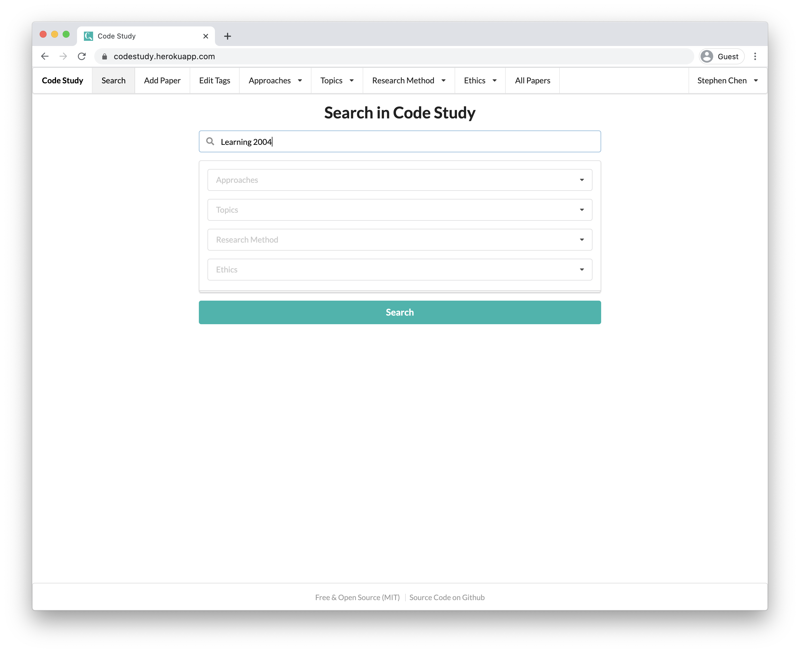
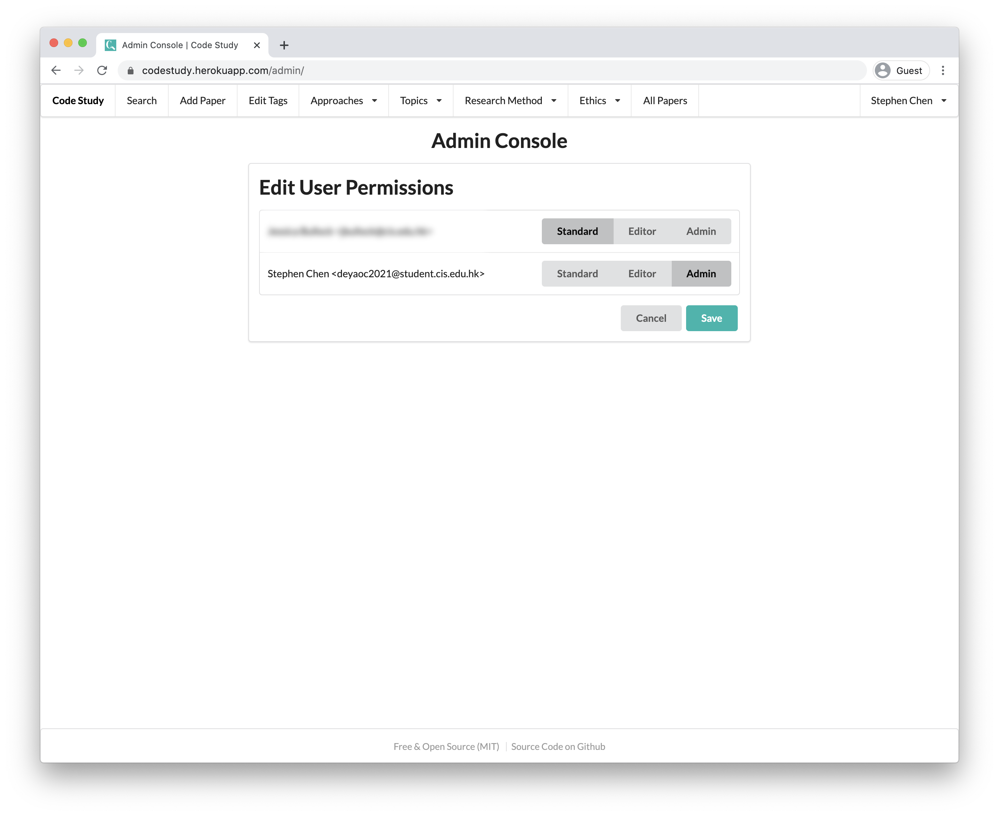
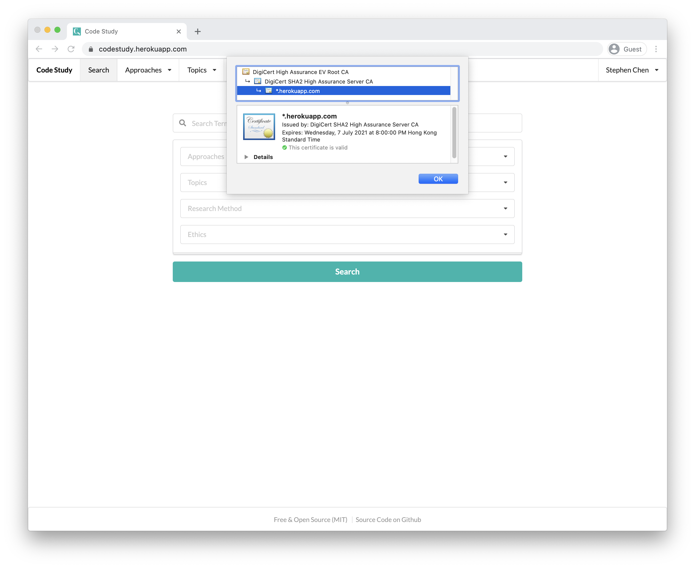
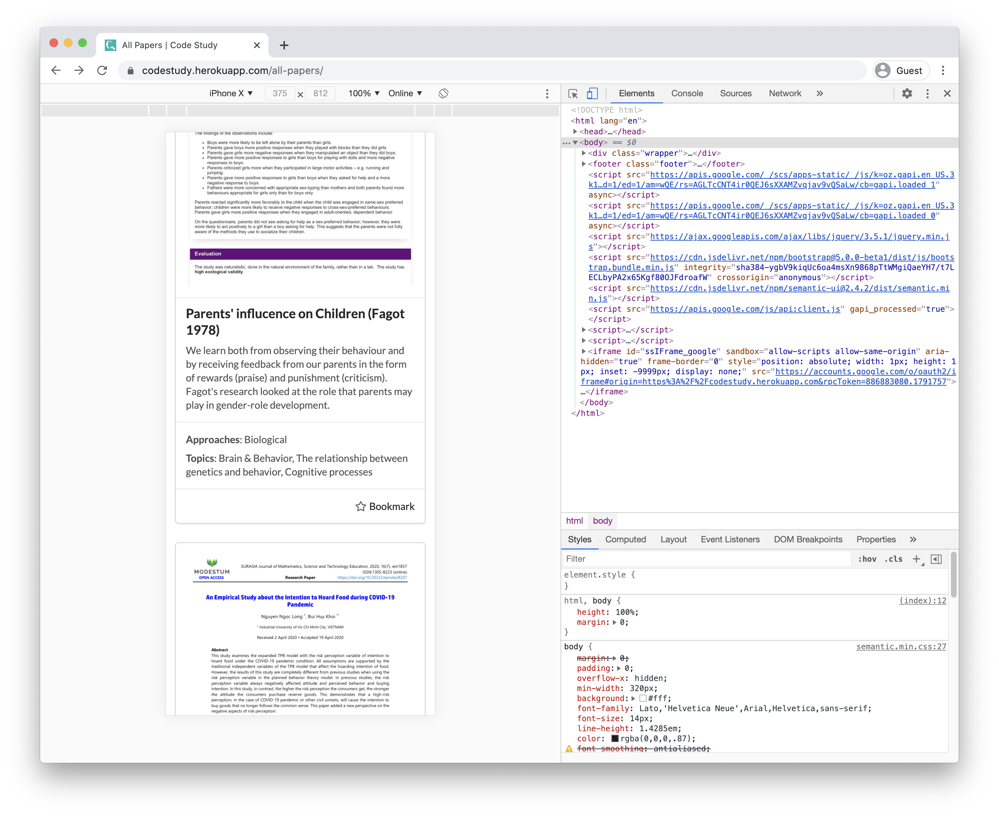

# Criterion A
## Description of Scenario

My client is the psychology teacher in my school. For the subject Psychology, students often need to quote studies to support their claims in their exams or research paper. The categorization for the paper are very specific to IB as well, such as the nine designated topics, the three different approaches. There is also a very specific set of code studies that are considered valid for the examinations. In my initial meeting with her (See Interview Transcript in Appendix), she said that students can benefit greatly from a search engine that can filter the studies for them as they would not need to manually go through all the studies themselves to find the relevant one. The current search engine such as Google Scholar and Jstor are not suitable for the specific scenario as they contain a very large dataset, many of the paper are not suitable for the IB Psychology. She told me that she would want students to be able to search for specific topics and approaches. She would also want to be able to guide students through manually tagging documents.

## Rational
I judged that using a web app would be most suitable for the Scenario. More specifically, using Django + Python + Semantic UI as the development frameworks, SQL, AWS S3 as the database and storage, and deployed on Heroku. A web app is chosen over a conventional app for several reasons. First, the database will be updated periodically by the teacher, so it would be convenient if all the students and teacher share the same database in order to eliminate the duplication of files. Second, a web app would load faster as it does not require download from the user. Third, it works cross platform as it would only require a web browser from the user to run well, which exist on almost all platforms such as Mac, Windows, Ubuntu Desktop and smartphones and tablets. It significantly widens the compatibility of the program without requiring the programmer to make a program for every platform. While cross platforms tools such as electron does exist, those are still unnecessary for the purpose of this project as the project would not need to be run offline. In addition, the city of the client has well-built internet infrastructure, so a slow or unavailable internet is not taken into account. Lastly, making this a web app significantly reduces the maintenance cost as an update can be pushed out instantly for everyone is there is a feature update. 

The reason to choose Python and Django as the back end framework is predominately due to the connivance. Python is chosen over other programming language such as Java and C++ because of the faster development speed in trade of the slower runtime speed (Barot). The program does not need to have excellent performance as there would not be too much traffic. A web development framework would be very beneficial as that eliminates the need to write a web app from scratch. Plain HTML, CSS and Javascript (i.e. a static website) is not suitable for this project as the database will be dynamically built by the client. For the exact reason, Django is chosen over other Python web development frameworks such as Flask because it has a very well-built interface for SQL databases that allow the user to interface with Python instead of SQL syntax (Singh). 

I choose Semantic UI as the front end development framework because it speeds up the development time as well. Semantic UI is particularly useful as it has a very large library of beautiful elements and modules for developers to incorporate into their design. 

## Success Criteria

### 1. Functionality
1. Admins and Editors can upload paper and add tags.
2. The search function would return relevant result.
3. Admins can add students to add studies to the website's database.
4. The user can to see the thumbnail and successfully download the PDF.
5. The storage should be large enough to store all the PDFs in the database.


### 2. Security
1. Only editors can modify the database.
2. Only the admins can modify manage user permissions.
3. The site in encrypted in transit.
4. Plain text password is never stored in the database. 

### 3. Accessibility
1. The UI would still work when it's zoomed in or viewed on a smaller device like a mobile screen.

# Criterion B

## Record of Tasks
|Task number|Planned Action                                                 |Planned Outcome                                                                                                                                                                                                                                                                                                                                                                                                                                                                                                                                                                       |Time Estimated|Target Date (yyyy/mm/dd)|Criterion|Stage         |
|-----------|---------------------------------------------------------------|--------------------------------------------------------------------------------------------------------------------------------------------------------------------------------------------------------------------------------------------------------------------------------------------------------------------------------------------------------------------------------------------------------------------------------------------------------------------------------------------------------------------------------------------------------------------------------------|--------------|------------------------|---------|--------------|
|1          |Interview with the client to understand her needs              |Understand her needs and have a vision for the website                                                                                                                                                                                                                                                                                                                                                                                                                                                                                                                                |2 hours       |2020/10/12              |A        |Planning      |
|2          |Preliminary research to find out the tools to use              |Understand the strength and weakness of of different frameworks and make a choice                                                                                                                                                                                                                                                                                                                                                                                                                                                                                                     |5 hours       |2020/10/20              |A        |Planning      |
|3          |Create the UI mockup for the website                           |Completed the mockups                                                                                                                                                                                                                                                                                                                                                                                                                                                                                                                                                                 |2 hours       |2020/10/28              |A        |Design        |
|4          |Create a rough prototype for the UI with hardcoded data        |Client confirms whether it is something she wants                                                                                                                                                                                                                                                                                                                                                                                                                                                                                                                                     |4 hours       |2020/11/4               |B, C     |Design        |
|5          |Push the project to Heroku and host the website                |The website is accessible through the internet                                                                                                                                                                                                                                                                                                                                                                                                                                                                                                                                        |1 hour        |2020/11/4               |C        |Implementation|
|6          |Restructure the website UI as per client's request to allow for multiple selection for tags|Client is happy with the new design                                                                                                                                                                                                                                                                                                                                                                                                                                                                                                                                                   |5 hours       |2020/11/14              |E        |Testing       |
|7          |Restructure the data structure of the website to allow for more flexibility|Client can create new tags and remove old ones                                                                                                                                                                                                                                                                                                                                                                                                                                                                                                                                        |5 hours       |2020/11/19              |C        |Developing    |
|8          |Test that I can create new paper objects in the database with new user interface|The objects would be created without no error                                                                                                                                                                                                                                                                                                                                                                                                                                                                                                                                         |3 hours       |2020/11/20              |C        |Testing       |
|9          |Setting the browser to upload directly to the s3 bucket instead of through the server|Website is much faster simply because the file server is located more locally                                                                                                                                                                                                                                                                                                                                                                                                                                                                                                         |5 hours       |2020/11/25              |C        |Developing    |
|10         |Fix a bug in django-storage :(                                 |The bug is fixed and the issue is still unaddressed by the library developers :(                                                                                                                                                                                                                                                                                                                                                                                                                                                                                                      |2 hours       |2020/12/4               |C        |Developing    |
|11         |Create the add tags page                                       |The page is finished and functional                                                                                                                                                                                                                                                                                                                                                                                                                                                                                                                                                   |5 hours       |2020/12/14              |C        |Developing    |
|12         |Integrate log in with google                                   |User can log in with Google and the UI looks integrated                                                                                                                                                                                                                                                                                                                                                                                                                                                                                                                               |6 hours       |2020/12/19              |C        |Developing    |
|13         |Refactor the user types so that different users have different permissions|User with their respective permissions can accomplish different tasks                                                                                                                                                                                                                                                                                                                                                                                                                                                                                                                 |2 hours       |2020/12/22              |C        |Developing    |
|14         |Add an admin page for admins to manage user permissions        |Admins can change the permissions of other users                                                                                                                                                                                                                                                                                                                                                                                                                                                                                                                                      |3 hours       |2020/12/26              |C        |Developing    |
|15         |Write the search engine                                        |The search engine works and returns relevant results                                                                                                                                                                                                                                                                                                                                                                                                                                                                                                                                  |4 hours       |2021/1/2                |C        |Developing    |
|16         |Write the edit paper page                                      |User can edit the paper even after it is uploaded                                                                                                                                                                                                                                                                                                                                                                                                                                                                                                                                     |3 hours       |2021/1/5                |C        |Developing    |
|17         |Get the client feedback for the finished product               |Client is happy                                                                                                                                                                                                                                                                                                                                                                                                                                                                                                                                                                       |2 hours       |2020/1/9                |E        |Testing       |
|18         |Conduct user training by given the client a 20 minute walk through of the program|The user knows how to use the website                                                                                                                                                                                                                                                                                                                                                                                                                                                                                                                                                 |20 minutes    |2020/1/20               |E        |Implementation|


## Use Cases

### Iteration 1 

\

### Iteration 2

\

The client feedback that she would like to use the help of students to manage some paper for her but would not want them to change who can edit the papers (See Meeting #2 transcript in Appendix). Therefore I have decided to refactor the user into three groups: standard, editor and admin. Standard users can only view the website and bookmark for themselves, editors can, in addition, add, edit and remove papers, and admin can, in addition, manage the permissions of users.

## UML

### Iteration 1

\

### Iteration 2

\

This UML reflects changes in the data structure from one specific to the structure of psychology units and paper to that of a general tagging system. As I talked my client, it was difficult for me to get all the tag groups that she needs, and there seemed to be more she would want later (see Meeting #2 Transcript in Appendix). Therefore I have decided to hand the control of the specific tags to user and generalize the data structure to accommodate it. The user now also has their type, allowing them to have different permission to edit the content. 

## Mockup

### Landing Page
This is the page that the user first sees when he/she open the application. It presents them options for their search. Layout is powered by Bootstrap.

#### Iteration 1

\ 

#### Iteration 2

\ 

After the first iteration, the client game me feedback that she would want to be able to select multiple topic and approaches for each search box (See Meeting #2 Transcript in Appendix). After I have found no way to implement it with Bootstrap and I didn't want to write UI from scratch because it will inevitably look ugly, I found out that I could use a framework called Semantic UI.

### Results Page

#### Iteration 1

\ 

This is the page where users get their search results in these card-like info boxes, from which they can see the results. 

#### Iteration 2

\ 

This iteration is unchanged in principle compared with the first iteration, but since I changed the framework, the design looks different.

### Edit Tags Page

This page is used to add and delete tag and tag groups in the database.

#### Iteration 1

\ 

## Design Description
The program is entirely based on the web, part of the functionality will be accomplished through JS running on client's computer, but a core part of the program will be accomplished through back-end code in Python running on Heroku and storage stored in AWS S3.  The UI will be rendered using client's web browser.


## Class Dictionary

### Class - Paper
This class represents a paper stored in the database

#### Properties
##### Iteration 1
|Property Name|Signature                           |Description                                                                                                                                                      |
|-------------|------------------------------------|-----------------------------------------------------------------------------------------------------------------------------------------------------------------|
|tags         |tags: String[]                      |This returns the tags that the paper is associated with through manual assignment or automatic detection by the classifier.                                      |
|topics       |topics: String[]                    |Self-explanatory. Similar as above.                                                                                                                              |
|approaches   |approaches: String[]                |Self-explanatory. Similar as above.                                                                                                                              |
|methods      |methods: String[]                   |Self-explanatory. Similar as above.                                                                                                                              |
|ethics       |ethics: String[]                    |Self-explanatory. Similar as above.                                                                                                                              |
|pdf          |pdf: File                           |This stores the pdf of the paper                                                                                                                                 |
|png          |png: File                           |This stores the screenshot of the first page to be displayed on the results page.                                                                                |
|text         |text: String[]                      |This is the content of the paper, extracted in plain text form to increase the search speed.                                                                     |

#### Iteration 2
|Property Name|Signature         |Description                                                                                                                |
|-------------|------------------|---------------------------------------------------------------------------------------------------------------------------|
|title        |title:String      |This is the title of the paper that the user inputs, short and direct.                                                      |
|description  |description:String|This is the description of the paper that the user inputs. It can be used as a abstract of the paper.                      |
|tags         |tags: String[]    |This returns the tags that the paper is associated with through manual assignment or automatic detection by the classifier.|
|pdf          |pdf: File         |This stores the pdf of the paper                                                                                           |
|png          |png: File         |This stores the screenshot of the first page to be displayed on the results page.                                          |
|text         |text: String[]    |This is the content of the paper, extracted in plain text form to increase the search speed.                               |

I realised that the user wants more flexibility to add and remove tag that I cannot foresee during development, so I've generalized the class to allow for more flexibility.

#### Methods
This class does not have any method.

### Class - Search Engine
This is an API for interacting with the search engine that returns the paper given some phrases. The implementations of the methods are not shown here. It might be implemented with the Google Search Engine or one that I write myself. A search engine is algorithm-based, therefore it's difficult to break it down into smaller methods. 

#### Properties
This class does not have any property.

#### Methods
##### Iteration 1
|Method Name |Signature                                                                                                                             |Description                                                                                              |
|------------|--------------------------------------------------------------------------------------------------------------------------------------|---------------------------------------------------------------------------------------------------------|
|searchPapers|searchPapers(keywords: String[], tags: String[], topics: String[], approaches: String[], methods: String[], ethics: String[]): Paper[]|This returns the set of paper, in order of relevance, based on a series of parameters the user has given.|

##### Iteration 2
|Method Name |Signature                                                        |Description                                                                                              |
|------------|-----------------------------------------------------------------|---------------------------------------------------------------------------------------------------------|
|searchPapers|searchPapers(keywords: String[], tags:Tag[], user: User): Paper[]|This returns the set of paper, in order of relevance, based on a series of parameters the user has given.|

Since the refactor, the tags do not have their hard coded tag groups, so the method parameter is less. 

### Class - User
This class represents a registered user

#### Properties

##### Iteration 1
|Property Name|Signature     |Description                                                                     |
|-------------|--------------|--------------------------------------------------------------------------------|
|name         |name: String  |The name of the user.                                                          re |
|email        |name: Email   |The email of the user.                                                          |
|type         |type: UserType|The type of the user, i.e. whether it is a standard user, an editor or an admin.|

##### Iteration 2
|Property Name|Signature         |Description                                                                     |
|-------------|------------------|--------------------------------------------------------------------------------|
|name         |name: String      |The name of the user.                                                           |
|email        |name: Email       |The email of the user.                                                          |
|type         |type: UserType    |The type of the user, i.e. whether it is a standard user, an editor or an admin.|
|bookmarks    |bookmarks: Paper[]|The papers that the users have bookmarked.                                      |

This iteration reflects the added functionality of allowing users to bookmark paper and having users who have different permissions. 

#### Methods
This class does not have have any method.

## Algorithm / DFD
The following code is written in python-like pseudocode.

### Uploaded Paper processing
```
def process_pdf(paper):
    screenshot = screenshot_pdf(paper)
    text = extract_text(paper)
    return screenshot, text

def screenshot_pdf(paper):
    ... # To be implemented using external library
    return screenshot

def extract_text(paper):
    raw_text = ... # To be implemented using external library
    text = raw_text.lower().replace(continuous-white-space, " ").replace(punctuations, "")
```

### Search algorithm
```
def search_ranked(terms, tags, user):
    terms = terms.lower().replace(continuous-white-space, " ").replace(punctuations, "")
    scores = {}
    for paper in database.all_papers:
        scores[paper] = 0
    for paper in database.all_papers:
        score = scores[paper]
        if paper.is_bookmarked_by(user):
            scores += weighting
        score += levenshtein_distance_score(terms, paper.title) * weighting
        socre += levenshtein_distance_score(terms, paper.description) * weighting
        score += levenshtein_distance_score(terms, paper.text) * weighting
        # paper.tags_contains_count(tags) is the size of the intersection of tags of the paper and tags.
        # paper.tags_no_contain_count(tags) count the size of the relative complement of the tags in the paper in tags.
        score += paper.tags_contains_count(tags) / len(tags) * weighting
        score += paper.tags_no_contain_count(tags) / len(max([paper.tags_no_contain_count(tags) for paper in database.all_papers]))
    return scores.sorted_by_value()
```

### Infrastructure / Database Design

\

The structure of the SQL database:

```
codestudy::DATABASE=> \d
                           List of relations
 Schema |               Name                |   Type   |     Owner
--------+-----------------------------------+----------+----------------
 public | auth_group                        | table    | ivpfdqmvlivkii
 public | auth_group_id_seq                 | sequence | ivpfdqmvlivkii
 public | auth_group_permissions            | table    | ivpfdqmvlivkii
 public | auth_group_permissions_id_seq     | sequence | ivpfdqmvlivkii
 public | auth_permission                   | table    | ivpfdqmvlivkii
 public | auth_permission_id_seq            | sequence | ivpfdqmvlivkii
 public | auth_user                         | table    | ivpfdqmvlivkii
 public | auth_user_groups                  | table    | ivpfdqmvlivkii
 public | auth_user_groups_id_seq           | sequence | ivpfdqmvlivkii
 public | auth_user_id_seq                  | sequence | ivpfdqmvlivkii
 public | auth_user_user_permissions        | table    | ivpfdqmvlivkii
 public | auth_user_user_permissions_id_seq | sequence | ivpfdqmvlivkii
 public | codestudy_paper                   | table    | ivpfdqmvlivkii
 public | codestudy_paper_tags              | table    | ivpfdqmvlivkii
 public | codestudy_paper_tags_id_seq       | sequence | ivpfdqmvlivkii
 public | codestudy_tag                     | table    | ivpfdqmvlivkii
 public | codestudy_tagclass                | table    | ivpfdqmvlivkii
 public | codestudy_user                    | table    | ivpfdqmvlivkii
 public | codestudy_user_bookmarks          | table    | ivpfdqmvlivkii
 public | codestudy_user_bookmarks_id_seq   | sequence | ivpfdqmvlivkii
 public | django_admin_log                  | table    | ivpfdqmvlivkii
 public | django_admin_log_id_seq           | sequence | ivpfdqmvlivkii
 public | django_content_type               | table    | ivpfdqmvlivkii
 public | django_content_type_id_seq        | sequence | ivpfdqmvlivkii
 public | django_migrations                 | table    | ivpfdqmvlivkii
 public | django_migrations_id_seq          | sequence | ivpfdqmvlivkii
 public | django_session                    | table    | ivpfdqmvlivkii
(27 rows)
```

\

### Upload Paper 

\ 

### Search Results

\ 

## Test Plan 
|Action to Test                                                                                                             |Method of Testing                                              |Expected Results                                                                                                                                                                                                                                                                                                                                                                                                                                                                                                                                                                      |Success Criteria|
|---------------------------------------------------------------------------------------------------------------------------|---------------------------------------------------------------|--------------------------------------------------------------------------------------------------------------------------------------------------------------------------------------------------------------------------------------------------------------------------------------------------------------------------------------------------------------------------------------------------------------------------------------------------------------------------------------------------------------------------------------------------------------------------------------|----------------|
|When the upload is invalid, it should gracefully fall back to an none-intrusive error message                              |Alpha Testing, Beta Testing, User Acceptance Testing, Debugging|Normal Input: The user uploads a paper. Expected Output: The website responds immediately to user's and start processing. Abnormal Input: The user selects a file that is not a PDF, leaves some fields empty, or clicks the button multiple times. Expected Output: The website should nicely notify the user that they have not inputted the right data (i.e. no js alter()). The user should not be able to submit the form multiple times. Extreme Input: Adversary tries to upload paper into the base without permission. Expected Output: The website should block the request.|1.1, 2.2        |
|User should be notified when there is an error in the server                                                               |Alpha Testing, Debugging                                       |Normal Input: Everything works in the server. Expected Output: Everything proceeds as normal. Abnormal Input: The server crashes. Expected Output: A custom 500 page that notifies the user that something went wrong in the server. Extreme Input: The server crashes again when trying to catch the error. Expected Output: falls back to an even safer error page that is more unlikely to fail.                                                                                                                                                                                   |All             |
|If a paper fails to upload or process, the server should display as much information as possible without entirely crashing |Alpha Testing, Debugging                                       |Normal Input: Everything works. Expected Output: Everything proceeds as normal. Abnormal Input: The file is corrupt such that the server cannot process the file. Expected Output: when the user requests for the file, the server should display that the file has failed to render, but the failure should not affect any other paper. Extreme Input: the file triggers an exception in unexpected place. Expected Output: the paper that is being uploaded should be the only paper that is affect by the bug.                                                                     |1.3, 1.5, 1.6   |
|User can log in                                                                                                            |Alpha Testing,Beta Testing,User Acceptance Testing             |Normal Input: the user logs in with Google clicking the right buttons. Expected Output: the user logs in as normal. Abnormal Input: the users logs in with the wrong email account. Expected Output: the user is still logged in, but they can log out. Extreme Input: the user does not accept any cookie. Expected Output: login fails.                                                                                                                                                                                                                                             |1.4, 2.1, 2.2   |
|Support for zooming                                                                                                        |Alpha Testing, User Acceptance Testing                         |Normal Input:the user views it on a desktop or laptop with a large screen, or the user views it on a phone with a small screen. Expected Output: The website functions as normal and all functions are accessible. Abnormal Input: The user zooms in roo much. Expected Output: The website UI breaks down. Extreme Input: none                                                                                                                                                                                                                                                       |3.1             |
|All the links in the website are valid                                                                                     |Alpha Testing,Beta Testing,User Acceptance Testing             |Normal Input: The user clicks on a link on the page. Expected Output: the website functions as normal. Abnormal Input: The user enters something random into the browser address bar. Expected Output: the website returns a nice 404 page with helpful links. Extreme Input: attacker tries to inject code with the url. Expected Output: the server blocks it.                                                                                                                                                                                                                      |All             |
|The Admin can assign new editors                                                                                           |Alpha Testing, Beta Testing, Integration Testing               |Normal Input: the user tries to add new user to editors. Expected Output: the user can edit the database now. Abnormal Input: none. Extreme Input: none                                                                                                                                                                                                                                                                                                                                                                                                                               |1.3             |
|The PDF processor can successfully screenshot the first page of the PDF                                                    |Alpha Testing, User Acceptance Testing, Debugging              |Normal Input: the user uploads a valid PDF. Expected Output: the screenshot is successfully taken. Abnormal Input: The user selected the wrong PDF. Expected Output: the PDF is still processed, but the user can delete it later. Extreme Input: the user uploads an invalid PDF. Expected Output: the processor returns an error message                                                                                                                                                                                                                                            |1.5, 1.6        |
|Browser notifies that the site is encrypted in transit (in Firefox, there is a padlock icon on the left of the address bar)|Alpha Testing, Integrating Testing                             |Normal Input: the user requests for the HTTPS site. Expected Output: the server returns the signed and encrypted site. Abnormal Input: the user requests for the HTTP site. Expected Output: the server redirects the request to HTTPS. Extreme input: none.                                                                                                                                                                                                                                                                                                                          |2.3             |
|No plain text password stored in the database                                                                              |Alpha Testing, Debugging                                       |Input: none                                                                                                                                                                                                                                                                                                                                                                                                                                                                                                                                                                           |2.4             |

# Criterion C
On a high level overview, the website I designed is a dynamic web application that uses tags and title to organise pdf documents in a database, which, specifically for my client, are psychology papers that students will use, but because the application is highly dynamic, it can also be used for other types of paper. I will give a general overview of technical skills and algorithm.

Most of the processing is done in the server backend, with some light processing mostly responsible for the UI in the front end. All the users using the website share the same database. 

## List of Technical Skills

- Using multiple frameworks and languages.
- Using Django Models
- Using cloud storage (S3)
- Using JS to dynamically update the page content
- Concurrent programming with JS Promise
- Multithreading in the server to increase responsiveness
- Using presigned URL
- Securely handle API secrets in an open source application
- Graceful multiple fall back to increase responsiveness 

## List of Algorithm Used

- Concurrency to improve responsiveness
- Memorisation for optimisation
- Primitive Search algorithm

## Part 1: UI Design and Dynamic Web Layout

The UI was designed with Semantic UI, rendered with the help of Django Template language with some custom JS script for the dynamic elements. 

Example 1: Using Django template language to implement loose coupling. Because all pages share the same menu items and UI library, I have put them in one HTML and allows subsequent pages to extend on that to reduce the code size, reducing the potential sources of bugs. The HTML comments illustrate the technical skills. 

In `codestudy/template/codestudy/base.html`:

```html

<!DOCTYPE html>
<html lang="en">
<head>
		...
    <link rel="stylesheet" href="https://cdn.jsdelivr.net/npm/semantic-ui@2.4.2/dist/semantic.min.css"> <!--Semantic UI libray-->
    <meta name="google-signin-client_id"
          content="330093561618-bc6pprilkfqi5sc6oibm376psnfe9tub.apps.googleusercontent.com"> <!--Log in with Google library-->
    <link rel="shortcut icon" type="image/png" href=""/> <!--The favicon to be displayed-->
    <title>Code Study</title>
</head>
<body>
<div class="ui menu">
		...
     <!--Example of Dynamic UI. The options only show if the user has premission to edit the database-->
        <a class="item" id="menu-add-paper" href="">Add Paper</a>
        <a class="item" id="menu-edit-tags" href="">Edit Tags</a>
    
     <!--Example of Dynamic UI. The number of items in the menu expands as the user adds more tag class-->
        <div id="menu-{{ tag_class.pk }}" class="ui dropdown item">
            {{ tag_class.name }}
            <i class="dropdown icon"></i>
            <div class="menu">
                
                    <a class="item" href="">{{ tag.name }}</a>
                
            </div>
        </div>
    
    <a class="item" id="menu-all-papers" href="">All Papers</a>
		...
</div>
	...
<script src="https://ajax.googleapis.com/ajax/libs/jquery/3.5.1/jquery.min.js"></script>
<script src="https://cdn.jsdelivr.net/npm/bootstrap@5.0.0-beta1/dist/js/bootstrap.bundle.min.js"
        integrity="sha384-ygbV9kiqUc6oa4msXn9868pTtWMgiQaeYH7/t7LECLbyPA2x65Kgf80OJFdroafW"
        crossorigin="anonymous"></script>
<script src="https://cdn.jsdelivr.net/npm/semantic-ui@2.4.2/dist/semantic.min.js"></script>
<script src="https://apis.google.com/js/api:client.js"></script>
<script>
		...
</script>
 <!--Example of lose coupling in the Django template langauge. The block tag allows me to add more javascript based on the base-->

</body>
</html>
```

Example 2: Even though there are multiple ways to search for a paper, they all share the same HTML base template, except with different data. 

In `codestudy/templates/codestudy`:

```html



    {{ page_title }} | Code Study


    <div class="ui container">
         <!--Example of responsive UI design. If there is nothing, the UI displays a message affirmation so the page would not seem to not have loaded-->
            <div class="ui text container">
                <div class="ui message">
                    <div class="header">Nothing to Show</div>
                    <p>
                        There is nothing in the database that matches your search.
                    </p>
                </div>
            </div>
        
        <div class="ui three column stackable grid">
            
								... Layout for the paper. Omitted for concision.
								<!--Exampl of lose coupling. Depending on the paper variable passed in from Python script, the document will display different results-->
            
        </div>
    </div>


    <script>
				...
        function like(pk) { 
					  <!--Example of Dynamic web design. When the bookmark button is clicked, the JS immediately sends a request to the server to update the status. Notice that the user is not specified in the request because that is automatically delivered by a browser cookie for security purposes (because the cookie is signed upon login verification).--> 
            const likeBtn = $('#like-' + pk);
            const xhr = new XMLHttpRequest();
            xhr.open('GET', '?pk=' + pk);
            xhr.send();
            if (likeBtn.hasClass('outline')) {
                likeBtn.removeClass('outline');
            } else {
                likeBtn.addClass('outline');
            }
        }
    </script>

```

The templates in combination with a helper function `get_base_context(request)` in `codestudy/views.py` allows the dynamic menu bar to be displayed across all pages without much effort. 

In `codestudy/views.py`:

```python
def get_base_context(request):
    return {
        'user': get_user(request),
				# get_user is a helper function that returns the User object. Implementation of it will be addressed in the next section.
        'tag_classes': TagClass.objects.all()
    }
```

Beside the dynamic rendering on the server side, the client also uses dynamic rendering implemented using JS. One prime example is in `codestudy/templates/codestudy/edit-tags.html`:

```jsx
...
function htmlToElement(html) {
    let template = document.createElement('template');
    html = html.trim(); // Never return a text node of whitespace as the result
    template.innerHTML = html;
    return template.content;
}

function addTag(tagClassPk, tagClassName) {
    const newTagInput = $('#new_tag_input_' + tagClassPk);
    const tagName = newTagInput.val();
    const tagPk = uuid.v4();
    changeLog.newTags.push({
        pk: tagPk,
        name: tagName,
        tagClass: tagClassName
    });
    newTagInput.val('');
    $('#new_tags_' + tagClassPk).before(htmlToElement(`
        <tr id="tag_${tagPk}">
            <td>${tagName}</td>
            <td class="right aligned" onclick="deleteTag('${tagPk}')">
                <button class="ui icon button"><i class="trash icon"></i></button>
            </td>
        </tr>
    `))
}

function deleteTag(tagPk) {
    const tagUi = $(`#tag_${tagPk}`);
    const tagDeleteButton = tagUi.find('td > button');
    if (tagDeleteButton.hasClass('negative')) {
        tagDeleteButton.removeClass('negative');
        changeLog.deletedTags.delete(tagPk);
    } else {
        tagDeleteButton.addClass('negative');
        changeLog.deletedTags.add(tagPk);
    }
    tagDeleteButton.removeClass('active')
}

function addTagClass() {
    const newTagClassInput = $('#new_tag_class_input');
    const tagClassName = newTagClassInput.val();
    if (tagClassName === '') {
        const TagClassError = $('#tag_class_error');
        TagClassError.removeClass('hidden');
        setTimeout(() => TagClassError.addClass('hidden'), 2000);
        return;
    }
    const tagClassPk = uuid.v4();
    changeLog.newTagClasses.push({
        pk: tagClassPk,
        name: tagClassName,
    });
    newTagClassInput.val('');
    $('#new_tag_classes').before(htmlToElement(`
        <div id="tag_class_${tagClassPk}" class="ui stackable grid">
            <div class="twelve wide column">
                <h1>${tagClassName}</h1>
            </div>
            <div class="four wide column right aligned">
                <button class="ui icon fluid button" onclick="deleteTagClass('${tagClassPk}')"><i class="trash icon"></i></button>
            </div>
        </div>
        <table class="ui left aligned table">
            <tbody>
                <tr id="new_tags_${tagClassPk}">
                    <td>
                        <div class="ui input">
                            <input id="new_tag_input_${tagClassPk}" type="text" placeholder="New tag...">
                        </div>
                    </td>
                    <td class="right aligned">
                        <button class="ui icon button" onclick="addTag('${tagClassPk}', '${tagClassName}')"><i class="plus icon"></i></button>
                    </td>
                </tr>
            </tbody>
        </table>
    `));
}
...
```

Importantly, the webpage tracks and uploads only the changes to the database instead of the entire data The `addTag` and `addClass` functions adds the element to the webpage with the relevant click handler. Admittedly, using a string to render html element is not the most efficient and elegant approach. I should create reusable elements using frameworks like React, but judging this is the only page that requires such dynamic rendering, the improved efficiency would not justify the cost. 

Another example of dynamic rendering is in selecting the ways to upload. The user can either choose to upload a link or a PDF by selecting from the dropdown menu. The JS element will then change the requirement validation of the form accordingly.


In `codestudy/templates/codestudy/add-paper.html`:

```jsx
...
uploadOptionsSelect
    .dropdown({
        onChange: function (value, text, $selectedItem) {
            uploadOption = Number(value);
            if (uploadOption === uploadOptionsEnum.file) {
								// Change the element displayed on the screen
                pdf.removeAttr('hidden');
                link.attr('hidden', 'hidden');
								// Update form validation standard
                form.form({
                    fields:
                        {
                            title: 'empty',
                            description: 'empty',
                            pdf: 'empty',
                        }
                });
            } else if (uploadOption === uploadOptionsEnum.link) {
								// Change the element displayed on the screen
                pdf.attr('hidden', 'hidden');
                link.removeAttr('hidden');
								// Update form validation standard
                form.form({
                    fields:
                        {
                            title: 'empty',
                            description: 'empty',
                            link: 'empty',
                        }
                });
            } else {
								// Assertion to notify a potential source of bug
                console.assert(false, "Upload Option does not match any known type");
            }
        }
    })
;
...
```


## Part 2: Storage and Database

The storage was implemented in AWS S3, and database uses PostgresSQL build in on Heroku. This illustrates my technical ability of using cloud database.

There are primarily three parts that enabled the cloud storage — provisioning and configuring an S3 bucket, integrating the storage into Django models, and optimisation by allowing the user to directly upload into the s3 bucket without having to go through the server. 

The bucket is called `codestudy` — the name of the application, and an IAM user is created in AWS with the following policy.

```json
{
    "Version": "2012-10-17",
    "Statement": [
        {
            "Sid": "VisualEditor0",
            "Effect": "Allow",
            "Action": "s3:ListBucket",
            "Resource": "arn:aws:s3:::codestudy"
        },
        {
            "Sid": "VisualEditor1",
            "Effect": "Allow",
            "Action": [
                "s3:PutObject",
                "s3:GetObject",
                "s3:DeleteObject"
            ],
            "Resource": "arn:aws:s3:::codestudy/*"
        }
    ]
}
```

Because the browser needs to upload paper into the database, I have to configure it so that it allows for cross-origin request that is normally blocked for security reasons ("Cross-origin resource"). It access from the `codestudy` url and `localhost` for development purposes.

```json
[
    {
        "AllowedHeaders": [
            "*"
        ],
        "AllowedMethods": [
            "PUT",
            "POST",
            "HEAD",
            "DELETE"
        ],
        "AllowedOrigins": [
            "https://codestudy.herokuapp.com",
            "http://localhost:8000"
        ],
        "ExposeHeaders": []
    },
    {
        "AllowedHeaders": [],
        "AllowedMethods": [
            "GET"
        ],
        "AllowedOrigins": [
            "*"
        ],
        "ExposeHeaders": []
    }
]
```

The S3 database requires API keys and secrete, but because I intend to have the application open source, I cannot direly put the keys in plain text in the source code (D33tah). Therefore, I have put them in the environmental variable with a file `.env` which is untracked by git and separately uploaded onto heroku. 

In `main/settings.py`:
```python
import dotenv

# Load the environment variables if there is such a file on the disk
dotenv_file = os.path.join(BASE_DIR, ".env")
if os.path.isfile(dotenv_file):
    dotenv.load_dotenv(dotenv_file)
...

# Load the environment variables into Python variables
AWS_ACCESS_KEY_ID = os.getenv('AWS_ACCESS_KEY_ID')
AWS_SECRET_ACCESS_KEY = os.getenv('AWS_SECRET_ACCESS_KEY')
```

In `.env`:
```
AWS_ACCESS_KEY_ID=...
AWS_SECRET_ACCESS_KEY=...
```

These demonstrate my technical ability to use cloud storage effectively.

The integration in the Django model is achieved through using the (buggy) `django-storage` library. Because the storage library does not support the Hong Kong server, I have to use a lower level library `boto3` to sign the object urls.

In `main/storage_backends.py`:
```python
from abc import ABC
from storages.backends.s3boto3 import S3Boto3Storage
from utils import generate_presigned_url


class MediaStorage(S3Boto3Storage, ABC):
    
    def url(self, name, parameters=None, expire=None, http_method=None):
        # Not sure what http_method will give, so default to https in all cases (there's not many reasons to use http).
        if expire is None:
            expire = 3600
        response = generate_presigned_url(name, 600)
        return response
```

In `utils.py`:
```python
from django.conf import settings
import boto3
import botocore.client

# Make a persistent s3 client
s3_client = boto3.client('s3',
                         aws_access_key_id=settings.AWS_ACCESS_KEY_ID,
                         aws_secret_access_key=settings.AWS_SECRET_ACCESS_KEY,
                         config=botocore.client.Config(s3={'addressing_style': 'virtual'}, signature_version='s3v4'),
                         region_name=settings.AWS_S3_REGION_NAME)


def generate_presigned_url(object_key, expiration):
    presigned_url = s3_client.generate_presigned_url('get_object',
                                                     Params={'Bucket': settings.AWS_STORAGE_BUCKET_NAME,
                                                             'Key': object_key},
                                                     ExpiresIn=expiration)
    return presigned_url

```

In the previous code example, I have overridden the default general url function to use a lower level function provided by `boto3` and wrapped in `utils.py`.

JS in the browser allows hte user to upload to s3 directly, greatly improving the speed of the website.

In `codestudy/templates/codestudy/add-paper.html`:
```html
...
<button type="button" class="ui fluid large teal button" id="fake-submit" onclick="fs()">Add</button>
<!-- fs stands for fake submit, btw -->
...
<script>
    ...
    async function fs() {
        const submit = $('#submit');
        // If the form is invalid, click the button so that the error can show. If the file is uploaded, click the 
        // button so that the form can be submitted. If a link is supplied, click the submit button normally because 
        // there is no extra step to handle file upload.
        if (uploaded || !form.form('is valid') || uploadOption === uploadOptionsEnum.link) {
            submit.click();
            return;
        }
        // The button that the user clicks is a dummy button so that the JS code can intercept.
        $('#fake-submit').css('display', 'none');
        bar.css('display', 'block');
        // Clean the data and get the upload credentials from the server.
        const s3Data = await getS3Data(pdf.val().replace(/C:\\fakepath\\/i, ''));
        let fileName = await uploadFile(pdf.prop('files')[0], s3Data);
        $('#pdf-key').val(fileName);
        pdf.val(null);
        // Clear the form validation .
        form.form({});
        uploaded = true;
        submit.click();
    }

    /** This gets the presigned data from the server in order for the browser to upload, and returns a Promise
     * of the data.
     * @param {string} fileName The file name of the file to be uploaded. Used as part of the presigned signature.
     * @return {Promise<Object>} The presigned S3 data.
     */
    function getS3Data(fileName) {
        return new Promise((resolve, reject) => {
            const url = "?" + $.param({file_name: fileName});
            $.get(
                url,
                data => resolve(data)
            )
        });
    }

    /**
     * Upload the file given file to the S3 bucket.
     * @param {File} file The file to be uploaded.
     * @param {Object} s3Data The presigned S3 data.
     * @return {Promise<string>} The object key in the S3 bucket.
     */
    function uploadFile(file, s3Data) {
        return new Promise(resolve => {
            postData = ... // Add the post data as required by s3 specifications.
            xhr.onreadystatechange = () => {
                if (xhr.readyState === 4 && (xhr.status === 200 || xhr.status === 204)) {
                    resolve(s3Data.fields.key);
                }
            };
            xhr.send(postData);
        });

    }
</script>
```

In particular in `getS3Data(fileName)`, I have demonstrated my ability to code using concurrency in JS through Promise. I have also demonstrated to dynamically communicate between the front-end and the back-end.

## Part 3: User Login, Permissions & Security
Logging in is achieved through Sign in with Google. I have decided not to use username and password because that leads to higher security vulnerability as now I have to handle hashing, salting and storing the user data safely myself (Scott). Sign in with Google is easier for use as well. 

In `codestudy/templates/base.html`:
```html
<script>
    function logout() {
        // Use JS to visit the logout url.
        const xhr = new XMLHttpRequest();
        xhr.open('GET', '');
        xhr.onload = () => {
            location.reload();
        };
        xhr.send();
    }

    function sendIdToken(idToken) {
        // Send the id token to server for validation.
        var xhr = new XMLHttpRequest();
        xhr.open('POST', "");
        xhr.setRequestHeader('Content-Type', 'application/x-www-form-urlencoded');
        xhr.onload = function () {
            const response = JSON.parse(xhr.responseText);
            location.reload();
        };
        xhr.send('id-token=' + idToken + '&csrfmiddlewaretoken=' + '{{ csrf_token }}');

    }

    gapi.load('auth2', function () {
        // Retrieve the singleton for the GoogleAuth library and set up the client.
        const auth2 = gapi.auth2.init({
            client_id: '330093561618-bc6pprilkfqi5sc6oibm376psnfe9tub.apps.googleusercontent.com',
            cookiepolicy: 'single_host_origin',
            // Request scopes in addition to 'profile' and 'email'
            //scope: 'additional_scope'
        });
        const element = document.getElementById('loginBtn');
        // Attach sign-in with Google to the sign-in button. 
        auth2.attachClickHandler(element, {},
            function (googleUser) {
                const id_token = googleUser.getAuthResponse().id_token;
                sendIdToken(id_token)
            }, function (error) {
                console.error(error);
            });
    });
</script>
```

In `codestudy/views.py`:
```python
...
def login(request):
    """
    This is a Django handler function that verifies the login details according to the token gained by signing in with
    Google. Designed to be interacted programmatically
    :param request: The Django Request object
    :return: The login status in JSON format
    """
    if request.method == 'POST':
        id_token = request.POST['id-token']
        try:
            # Specify the CLIENT_ID of the app that accesses the backend:
            id_info = google.oauth2.id_token.verify_oauth2_token(id_token,
                                                                 google.auth.transport.requests.Request(),
                                                                 settings.G_CLIENT_ID)

            user = User.objects.get_or_create(pk=id_info['sub'])[0]
            # Save the user info provided by Google to the database.
            user.email = id_info['email']
            user.name = id_info['name']
            user.given_name = id_info['given_name']
            user.family_name = id_info['family_name']
            user.save()
            request.session['sub'] = user.pk
            success = True
        except ValueError:
            # Invalid token
            success = False
    else:
        raise Http404()
    return JsonResponse({
        'success': success
    })
...
def logout(request):
    """
    This is a Django handler function that logs the current user out. Designed to be accessed programmatically.
    :param request:
    :return:
    """
    try:
        # Delete the sessoin cookie.
        del request.session['sub']
        success = True
    except KeyError:
        success = False
    return JsonResponse({'success': success})
...
```

The logout function visits the log out page, which clears the This demonstrates my technical ability to integrate existing framework into my own app. The login function verifies the login details. For security, the data is accepted through post because the django post function requires a Cross-site request forgery token, which prevents arbitrary access to the database. In addition, I followed the documentation and used the id-token, which is signed with the secrete key of the Google API. This demonstrates my ability to handle user authentication well. 

In order to prevent unauthorized access, not only is the corresponding url hidden from view, but direct access to the urls will return a 404 page as if the pages don't exist. 

In `codestudy/views.py`:
```python
def add_paper(request):
    if get_user(request) and get_user(request).can_edit:
        ...
    else:
        raise Http404()

```

## Part 4: PDF processing

I need to complete two tasks with the PDF: extract the first page as a PNG image, and extract the plain text from the PDF to be used by the search engine, which is using the algorithm of optimization by memorization. Thankfully I was able to find external high-level libraries: `pdf2image` and `textract`. All I needed to do was to wrap the library so that I can integrate it easily into the website.

In `codestudy/pdf_processor.py`:
```python
import pdf2image
import os
from django.contrib.staticfiles.storage import staticfiles_storage
import re
import logging
import uuid
import textract
import string


def pdf_to_png_and_save(paper):
    """
    Takes a paper with the pdf file, capture the first page as a png and saves it to the paper object.
    :param paper: The Paper object to be processed.
    :return: None
    """
    # noinspection PyBroadException
    try:
        # Grab the screenshot of the first page
        paper.pdf.seek(0, 0)
        pdf_byte = paper.pdf.read()
        image = pdf2image.convert_from_bytes(pdf_byte, last_page=1, dpi=100)[0]
        png_name = str(uuid.uuid4())
        image.save(png_name, 'PNG')
        with open(png_name, 'rb') as f:
            paper.png.save(os.path.basename(paper.pdf.name).replace('.pdf', '') + '.png', f)
        os.remove(png_name)
        paper.pdf.close()
    except:
        # Processing has filed, fall back to default failed image.
        logging.exception('exception occurred converting pdf to png')
        with open(staticfiles_storage.path('failed/failed.png'), 'rb') as f:
            paper.png.save('failed.png', f)


def get_text(paper):
    """
    Extract the text content in the pdf, turn all characters to lowercase and replace each continuous whitespace with
    one space.
    :param paper: The Paper object to be processed.
    :return: The plain text in the paper.
    """
    id1 = str(uuid.uuid4())
    _RE_COMBINE_WHITESPACE = re.compile(r"\s+")
    paper.pdf.seek(0, 0)
    with open(id1, 'wb') as of:
        of.write(paper.pdf.read())
    paper.pdf.close()
    text = textract.process(id1, extension='pdf').decode('utf-8')
    os.remove(id1)
    # Replace all white spaces with space:
    # https://stackoverflow.com/questions/2077897/substitute-multiple-whitespace-with-single-whitespace-in-python
    # Strip punctuation: https://stackoverflow.com/questions/265960/best-way-to-strip-punctuation-from-a-string
    return _RE_COMBINE_WHITESPACE.sub(" ", text).lower().translate(str.maketrans('', '', string.punctuation))
```

In the `pdf_to_png_and_save` function, I used fall backs and uses a `filed.png` file to be stored in the database, demonstrating my ability to gracefully fall back to increase responsiveness. I have also used lower level API such as `.seek(0,0)` to copy the file from Django file field onto the hard drive where `pdf2image` can access.

In the `get_text` function, not only did I extract the text, but also did preprocessing to replace each continuous span of white spaces with a single space to aid with finding the Levenshtein distance later during the search.

In `codestudy/views.py`:
```python
from .pdf_processor import pdf_to_png_and_save, get_text
...
def add_paper(request):
...
    def process(paper):
        pdf_to_png_and_save(paper)
        paper.text = get_text(paper)
        paper.save()
    Thread(target=process, args=(paper,)).start()
...
```

In order to search through the text in the PDF, I had to extract it as plain text first, but if I were to extract it every time the search is requested, it would be inefficient because extracting text from a PDF file is an expensive operation. Therefore, the text is only extracted once when the paper is initially uploaded, utilizing ptimization by memorisation. In addition, I have also used concurrency to improve responsiveness as the extraction can happen in the background after the user has gotten a response from the server.


## Part 5: The Search Engine

The search engine is quite a naive one, for the pseudocode of the algorithm, please see the criterion B document. 

## Part 6: Validation, Error handling and Fallbacks

Because of the unpredictability of the user input of a web app, when the website fails, it should give as much helpful information to the user as possible and the crash should affect as little part of the program as possible. 

The first action is to validate the user input in any form.

In `codestudy/templates/add-paper.html`:
```html
<script>
    const uploadOptionsSelect = $('#upload-option');
    const uploadOptionsEnum = Object.freeze({
        'file': 1,
        'link': 2,
    });
    let uploadOption = uploadOptionsEnum.file;
    uploadOptionsSelect
        .dropdown({
            onChange: function (value, text, $selectedItem) {
                uploadOption = Number(value);
                if (uploadOption === uploadOptionsEnum.file) {
                    pdf.removeAttr('hidden');
                    link.attr('hidden', 'hidden');
                    form.form({
                        fields:
                            {
                                title: 'empty',
                                description: 'empty',
                                pdf: 'empty',
                            }
                    });
                } else if (uploadOption === uploadOptionsEnum.link) {
                    pdf.attr('hidden', 'hidden');
                    link.removeAttr('hidden');
                    form.form({
                        fields:
                            {
                                title: 'empty',
                                description: 'empty',
                                link: 'empty',
                            }
                    });
                } else {
                    console.assert(false, "Upload Option does not match any known type");
                }
            }
        })
    ;
    uploadOptionsSelect.dropdown('set selected', uploadOptionsEnum.file);
</script>
```

This JS code in combination with that from Semantic UI verifies the input are not empty. Note that it is not necessary for me to sanitizes the input because Django automatically and by default escape strings so that code injection is impossible to my best knowledge. 

Because all the papers are rendered in one page using the Django template language, if a single rendering raises an exception, the entire page will fail to render. So I have added a few precautions to prevent that. 

In `codestudy/models.py`:
```python
class Paper(models.Model):
    ...

    png = models.FileField(default='failed.png')
    pdf = models.FileField(default='failed.pdf')
```

In case that fails,

in `codestudy/templates/codestudy/results.html`:
```html
...

    

...

    <a class="header" href="{{ paper.link }}">{{ paper.title }}</a>

    <a class="header" href="{{ paper.pdf.url }}">{{ paper.title }}</a>

```

In the above code, the template language checks if the files exists before trying to get the url from the model so that it would not show an exception. I have tested this by raising exceptions in various places to see if it crashes more than it should. 

This demonstrate my technical ability to handler errors gracefully. 

In addition, the 500 error also implement multiple level of fall backs. 

In `codestudy/views.py`:
```python
def handler500(request):
    try:
        context = get_base_context(request)
        context.update({
            'message': {
                'title': '500 Server Error',
                'description': 'Something went wrong. Please try again later.'
            }
        })
        return render(request, 'codestudy/base.html', context=context, status=500)
    except:
        return render(request, 'codestudy/500.html', status=500)
```

This function is hooked to the server error handler in Django. The first thing it tires is to have some dynamic element such as the header bar, if it still fails (which sometimes happens if the database is corrupt), it would return a static 500 page with all the links hardcoded. 

# Criterion D
[Criterion D Screencast](https://de0ch.s3.ap-east-1.amazonaws.com/csia/Criterion-D.mp4) <https://de0ch.s3.ap-east-1.amazonaws.com/csia/Criterion-D.mp4>

# Criterion E

## Demonstration of Success Criteria

My client has said that I've met all the success criteria (See Appendix Meeting #3 Transcript). Here are some screenshots for demonstration. 

### 1.1. Admins and Editors can upload paper and add tags

\


\

### 1.2. The search function would return relevant result

\


\

### 1.3. The admin can add students to add studies to the website's database

\

### 1.4. The user can to see the thumbnail and successfully download the PDF

\

### 1.5 The storage should be large enough to store all the PDFs in the database

There is no theoretical limit to the size of the S3 container as AWS charges by the amount of storage used.

### 2.1 Only editors can modify the database

\

### 2.2. Only the admins can modify manage user permissions

\

### 2.3. The site in encrypted in transit

\

### 2.4. Plain text password is never stored in the database

Not Applicable because I used Sign-in with Google with which the authentication is handled by Google. 

### 3.1. The UI would still work when it's zoomed in or viewed on a smaller device like a mobile screen.

\

## User Feedback
The user is very satisfied with the product. She said that it completely realises her vision (see Meeting #3 Transcript in Appendix). I was pleasantly surprised when she said she was actually going to use the website, and the app was not just an intellectual exercise. One improvement is to make an info page between the card and the PDF. The page can contain additional information such as the units the paper is related to, and similar paper (Meeting #3 Transcript). This will increase the functionality of the program and allow students to explore the subject more. 

Looking forward, there are a few improvements I formulated other than the client suggestions. First, I can improve the efficiency of the web program. SQL is, be design, very efficient for general purpose database, but since the search engine requires searching through plan text, there might be a more efficient data structure to index the data. The complexity of the search grows linearly with the number of papers in the database, so if the database gets large, the search function might be unreasonably slow. In addition, I could also write a more sophisticated search algorithm. Right now the ranking algorithm is quite primitive with no research to back up the weight of different aspect I assigned it. In addition, by controlling lower levels of the server, I could employ more layers of caching to make access faster. In addition, I could also add a list layout in addition to the grid layout for the result page because some people prefer to see data in a list. 

# Appendix

## Source code

Also available on [Github](https://github.com/de0ch/csia) <https://github.com/de0ch/csia>.

### File Tree
```
.
+-- .env
+-- .gitignore
+-- Aptfile
+-- Procfile
+-- README.md
+-- app.json
+-- codestudy
|   +-- __init__.py
|   +-- admin.py
|   +-- apps.py
|   +-- favicon.ai
|   +-- init_utils.py
|   +-- logins.py
|   +-- models.py
|   +-- pdf_processor.py
|   +-- search_engine.py
|   +-- static
|   |   +-- failed
|   |   |   +-- failed.pdf
|   |   |   \-- failed.png
|   |   \-- favicon.ico
|   +-- templates
|   |   \-- codestudy
|   |       +-- 500.html
|   |       +-- add-paper.html
|   |       +-- admin.html
|   |       +-- base.html
|   |       +-- edit-paper.html
|   |       +-- edit-tags.html
|   |       +-- index.html
|   |       +-- login.html
|   |       \-- results.html
|   +-- templatetags
|   |   +-- __init__.py
|   |   \-- codestudy_tags.py
|   +-- tests.py
|   +-- urls.py
|   \-- views.py
+-- main
|   +-- __init__.py
|   +-- settings.py
|   +-- storage_backends.py
|   +-- urls.py
|   \-- wsgi.py
+-- manage.py
+-- requirements.txt
+-- runtime.txt
\-- utils.py

7 directories, 41 files
```

### File Contents
In `requirements.txt`:
```
# Ipython is just the best
ipython

# Safekeeping Credentials
python-dotenv

# Django
django

# Heroku stuff
django-heroku
psycopg2
gunicorn

# S3 Storage
django-storages
boto3

# PDF Processing
pdf2image

# Authentication
requests
google-auth

# Extract PDF text
textract

# Search Engine
python-Levenshtein
fuzzywuzzy

```

In `app.json`:
```
{
  "name": "codestudy",
  "description": "A search engine for IB Psychology Studies",
  "image": "heroku/python",
  "repository": "https://github.com/heroku/python-getting-started",
  "keywords": ["ib", "psychology" ],
  "addons": [ "heroku-postgresql" ],
  "env": {
    "SECRET_KEY": {
      "description": "The secret key for the Django application.",
      "generator": "secret"
    }
  },
  "environments": {
    "test": {
      "scripts": {
        "test-setup": "python manage.py collectstatic --noinput",
        "test": "python manage.py test"
      }
    }
  }
}

```

In `runtime.txt`:
```
python-3.8.7

```

In `Aptfile`:
```
poppler-utils

```

In `.gitignore`:
```
venv
*.pyc
staticfiles
.env
creds.txt
db.sqlite3
getting-started/*

# ==== MAC OS gitignore
# General
.DS_Store
.AppleDouble
.LSOverride

# Icon must end with two \r
Icon


# Thumbnails
._*

# Files that might appear in the root of a volume
.DocumentRevisions-V100
.fseventsd
.Spotlight-V100
.TemporaryItems
.Trashes
.VolumeIcon.icns
.com.apple.timemachine.donotpresent

# Directories potentially created on remote AFP share
.AppleDB
.AppleDesktop
Network Trash Folder
Temporary Items
.apdisk

# ==== Pyharm
# Covers JetBrains IDEs: IntelliJ, RubyMine, PhpStorm, AppCode, PyCharm, CLion, Android Studio, WebStorm and Rider
# Reference: https://intellij-support.jetbrains.com/hc/en-us/articles/206544839

# User-specific stuff
.idea/**/workspace.xml
.idea/**/tasks.xml
.idea/**/usage.statistics.xml
.idea/**/dictionaries
.idea/**/shelf

# Generated files
.idea/**/contentModel.xml

# Sensitive or high-churn files
.idea/**/dataSources/
.idea/**/dataSources.ids
.idea/**/dataSources.local.xml
.idea/**/sqlDataSources.xml
.idea/**/dynamic.xml
.idea/**/uiDesigner.xml
.idea/**/dbnavigator.xml

# Gradle
.idea/**/gradle.xml
.idea/**/libraries

# Gradle and Maven with auto-import
# When using Gradle or Maven with auto-import, you should exclude module files,
# since they will be recreated, and may cause churn.  Uncomment if using
# auto-import.
# .idea/artifacts
# .idea/compiler.xml
# .idea/jarRepositories.xml
# .idea/modules.xml
# .idea/*.iml
# .idea/modules
# *.iml
# *.ipr

# CMake
cmake-build-*/

# Mongo Explorer plugin
.idea/**/mongoSettings.xml

# File-based project format
*.iws

# IntelliJ
out/

# mpeltonen/sbt-idea plugin
.idea_modules/

# JIRA plugin
atlassian-ide-plugin.xml

# Cursive Clojure plugin
.idea/replstate.xml

# Crashlytics plugin (for Android Studio and IntelliJ)
com_crashlytics_export_strings.xml
crashlytics.properties
crashlytics-build.properties
fabric.properties

# Editor-based Rest Client
.idea/httpRequests

# Android studio 3.1+ serialized cache file
.idea/caches/build_file_checksums.ser

```

In `utils.py`:
```
from django.conf import settings
import boto3
import botocore.client

s3_client = boto3.client('s3',
                         aws_access_key_id=settings.AWS_ACCESS_KEY_ID,
                         aws_secret_access_key=settings.AWS_SECRET_ACCESS_KEY,
                         config=botocore.client.Config(s3={'addressing_style': 'virtual'}, signature_version='s3v4'),
                         region_name=settings.AWS_S3_REGION_NAME)


def generate_presigned_url(object_key, expiration):
    presigned_url = s3_client.generate_presigned_url('get_object',
                                                     Params={'Bucket': settings.AWS_STORAGE_BUCKET_NAME,
                                                             'Key': object_key},
                                                     ExpiresIn=expiration)
    # presigned_url = fix_hk_s3_url(presigned_url)
    return presigned_url

```

In `.env`:
```
AWS_ACCESS_KEY_ID=...
AWS_SECRET_ACCESS_KEY=...
SECRET_KEY=...
IS_LOCAL=TRUE
DEBUG=FALSE

```

In `manage.py`:
```
#!/usr/bin/env python
import os
import sys

if __name__ == "__main__":
    os.environ.setdefault("DJANGO_SETTINGS_MODULE", "main.settings")

    from django.core.management import execute_from_command_line

    execute_from_command_line(sys.argv)

```

In `Procfile`:
```
web: gunicorn main.wsgi --log-file -

```

In `codestudy/models.py`:
```
from django.db import models
import uuid
from enum import IntEnum
# Create your models here.


class TagClass(models.Model):
    """
    A group of tags that have a title. For example, "Topic" is a tag class and under it there would be tags such as
    "Cognitive processes", "The individual and the group", "Cultural influences on behavior", etc.
    """
    id = models.UUIDField(primary_key=True, default=uuid.uuid4, editable=False)
    name = models.TextField()

    def __str__(self):
        return self.name


class Tag(models.Model):
    id = models.UUIDField(primary_key=True, default=uuid.uuid4, editable=False)
    tag_class = models.ForeignKey(TagClass, on_delete=models.CASCADE)
    name = models.TextField()

    def __str__(self):
        return self.name


class Paper(models.Model):
    id = models.UUIDField(primary_key=True, default=uuid.uuid4, editable=False)
    title = models.TextField()
    description = models.TextField()
    text = models.TextField()
    png = models.FileField()
    pdf = models.FileField(default='failed.pdf')
    link = models.TextField(null=True)
    tags = models.ManyToManyField(Tag)

    def is_bookmarked(self, user):
        """
        Get if the paper is bookmarked by the user.
        :param user: The User object in question.
        :return: Whether the paper is bookmarked.
        """
        return self.bookmarkers.filter(pk=user.pk).exists()

    def __str__(self):
        return self.title

    @property
    def nested_tag_names(self):
        """
        Get a dictionary of the names of all the tag classes as the keys, and the list of the names of all the tags as
        the values.
        :return: The dictionary.
        """
        tag_classes = {}
        for tag in self.tags.all():
            if tag.tag_class.name not in tag_classes:
                tag_classes[tag.tag_class.name] = []
            tag_classes[tag.tag_class.name].append(tag.name)
        return tag_classes


class UserType(IntEnum):
    """
    A Enum that maps the user type to integer. The mapping should be consistent with the front end JS code.
    """
    STANDARD = 1
    EDITOR = 2
    ADMIN = 3

    @classmethod
    def choices(cls):
        """
        Get a list of two-element tuples of the enum names and values. Helpful for specifying the data type in the database.
        :return: A list of two-element tuples of the enum names and values.
        """
        return [(key.value, key.name) for key in cls]


class User(models.Model):
    """
    Represents a logged in user.
    """
    id = models.TextField(primary_key=True, editable=False)
    type = models.IntegerField(choices=UserType.choices(), default=UserType.STANDARD)
    name = models.TextField()
    given_name = models.TextField()
    family_name = models.TextField()
    email = models.TextField()
    bookmarks = models.ManyToManyField(Paper, related_name='bookmarkers')

    def __str__(self):
        return self.name

    @property
    def all_types(self):
        """
        :return: All the user types as a dictionary of their names.
        """
        return [key.name for key in UserType]

    @property
    def can_edit(self):
        """
        :return: If the user have editing rights.
        """
        return self.type == UserType.EDITOR or self.type == UserType.ADMIN

    @property
    def is_admin(self):
        """
        :return: If the user is an admin
        """
        return self.type == UserType.ADMIN

    @property
    def type_lower(self):
        """

        :return: The name of the user type in lowercase.
        """
        return UserType(self.type).name.lower()


```

In `codestudy/search_engine.py`:
```
from codestudy.models import Paper
import re
import string
import fuzzywuzzy.process


def search(terms, tags, user):
    """
    The search engine that returns a ranked result based on the search terms, tags and user. The search term uses
    Levenshtein distance to ranked the relevance to the search term. The tag is counted such that the number of tag in
    the portion search query that matches that in the database is linearly related to the ranking score. The proportion
    of the element that is in the search term but not in the database is linearly related to one minus the ranking
    score. The user is used to place a higher relevance to the papers that the user have bookmarked. The weighing of
    each factor is provided below.
    Weights:
    properties: 3/4
        title + description: 1/3
            title: 2/3
            description: 1/3
        tags: 1/3
            has_tag: 2/3
            no_tag: 1/3
        others: 1/3:
            star_count: 2/3
            field_search: 1/3
    star: 1/4
    :param terms: the search terms.
    :param tags: the search tags.
    :param user: the user logged in.
    :return: A list of paper, ranked.

    """
    _RE_COMBINE_WHITESPACE = re.compile(r"\s+")
    terms = _RE_COMBINE_WHITESPACE.sub(" ", terms).lower().translate(str.maketrans('', '', string.punctuation))
    tags = set(tags)
    texts = []
    text_scores = {}
    titles = []
    title_scores = {}
    descriptions = []
    descriptions_scores = {}
    scores = {}
    max_no_tag = 1
    max_bookmarker = 1
    for paper in Paper.objects.all():
        titles.append(paper.title)
        descriptions.append(paper.description)
        texts.append(paper.text)
        scores[paper] = 0
        if user and paper.is_bookmarked(user):
            scores[paper] += 1/4
        no_tag = 0
        for tag in paper.tags.all():
            if tag not in tags:
                no_tag += 1
        max_no_tag = max(max_no_tag, no_tag)
        max_bookmarker = max(max_bookmarker, paper.bookmarkers.count())
    fz = fuzzywuzzy.process.extract(terms, texts)
    for text, score in fz:
        text_scores[text] = score / 100
    fz = fuzzywuzzy.process.extract(terms, titles)
    for title, score in fz:
        title_scores[title] = score / 100
    fz = fuzzywuzzy.process.extract(terms, descriptions)
    for description, score in fz:
        descriptions_scores[description] = score / 100
    for paper in scores:
        scores[paper] += title_scores.get(paper.title, 0) * 3/4 * 1/3 * 2/3
        scores[paper] += descriptions_scores.get(paper.description, 0) * 3/4 * 1/3 * 1/3
        scores[paper] += text_scores.get(paper.text, 0) * 3/4 * 1/3 * 1/3
        scores[paper] += paper.bookmarkers.count() / max_bookmarker * 3/4 * 1/3 * 2/3
        tag_has = 0
        paper_tags = set([tag for tag in paper.tags.all()])
        for tag in tags:
            if tag in paper_tags:
                tag_has += 1
        scores[paper] += tag_has / max(1, len(tags)) * 3/4 * 1/3 * 2/3
        tag_no = 0
        for paper_tag in paper_tags:
            if paper_tag not in tags:
                tag_no += 1
        scores[paper] += (max_no_tag-tag_no) / max_no_tag * 3/4 * 1/3 * 1/3

    papers_ranked = [k for k, v in sorted(scores.items(), key=lambda item: item[1], reverse=True)]
    return papers_ranked

```

In `codestudy/logins.py`:
```
from .models import User


def get_user(request):
    """
    :param request: the django request object
    :return: a dictionary of the information of the user
    Get a dictionary of the currently logged in user
    """
    try:
        sub = request.session['sub']
        user = User.objects.get(pk=sub)
        return user
    except (KeyError, User.DoesNotExist):
        return None

```

In `codestudy/__init__.py`:
```

```

In `codestudy/apps.py`:
```
from django.apps import AppConfig


class CodeStudyConfig(AppConfig):
    name = 'codestudy'

```

In `codestudy/init_utils.py`:
```
from .models import TagClass, Tag


def populate_new_database():
    """
    The client asked to have some specific tags, but because of the generality of the tag systems, the specific tags
    have to added manually. The function adds them programmatically.
    """
    tags_groups = {
        'Approaches': [
            'Biological',
            'Cognitive',
            'Sociocultural',
        ],
        'Topics': [
            'Brain & Behavior',
            'Hormones and pheromones and their effects on behavior',
            'The relationship between genetics and behavior',
            'Cognitive processes',
            'The reliability of cognitive processes',
            'Emotion and cognition',
            'The individual and the group',
            'Cultural origins of behavior and cognition',
            'Cultural influences on behavior',
        ],
        'Content': []
    }
    for tag_class, tags in tags_groups.items():
        tc = TagClass(name=tag_class)
        tc.save()
        for tag in tags:
            Tag(tag_class=tc, name=tag).save()


```

In `codestudy/admin.py`:
```
from django.contrib import admin

# Register your models here.

```

In `codestudy/pdf_processor.py`:
```
import pdf2image
import os
from django.contrib.staticfiles.storage import staticfiles_storage
import re
import logging
import uuid
import textract
import string


def pdf_to_png_and_save(paper):
    """
    Takes a paper with the pdf file, capture the first page as a png and saves it to the paper object.
    :param paper: The Paper object to be processed.
    :return: None
    """
    # noinspection PyBroadException
    try:
        paper.pdf.seek(0, 0)
        pdf_byte = paper.pdf.read()
        image = pdf2image.convert_from_bytes(pdf_byte, last_page=1, dpi=100)[0]
        png_name = str(uuid.uuid4())
        image.save(png_name, 'PNG')
        with open(png_name, 'rb') as f:
            paper.png.save(os.path.basename(paper.pdf.name).replace('.pdf', '') + '.png', f)
        os.remove(png_name)
        paper.pdf.close()
    except:
        logging.exception('exception occurred converting pdf to png')
        with open(staticfiles_storage.path('failed/failed.png'), 'rb') as f:
            paper.png.save('failed.png', f)


def get_text(paper):
    """
    Extract the text content in the pdf, turn all characters to lowercase and replace each continuous whitespace with
    one space.
    :param paper: The Paper object to be processed.
    :return: The plain text in the paper.
    """
    id1 = str(uuid.uuid4())
    _RE_COMBINE_WHITESPACE = re.compile(r"\s+")
    paper.pdf.seek(0, 0)
    with open(id1, 'wb') as of:
        of.write(paper.pdf.read())
    paper.pdf.close()
    text = textract.process(id1, extension='pdf').decode('utf-8')
    os.remove(id1)
    # Replace all white spaces with space:
    # https://stackoverflow.com/questions/2077897/substitute-multiple-whitespace-with-single-whitespace-in-python
    # Strip punctuation: https://stackoverflow.com/questions/265960/best-way-to-strip-punctuation-from-a-string
    return _RE_COMBINE_WHITESPACE.sub(" ", text).lower().translate(str.maketrans('', '', string.punctuation))


```

In `codestudy/tests.py`:
```
from django.test import TestCase

# Create your tests here.

```

In `codestudy/urls.py`:
```
from django.urls import path, include
from . import views


app_name = 'codestudy'
urlpatterns = [
    path('search/', views.search, name='search'),
    path('', views.index, name='index'),
    path('add-paper/', views.add_paper, name='add-paper'),
    path('add-paper/presign-s3', views.presign_s3, name='presign-s3'),
    path('edit-tags/', views.edit_tags, name='edit-tags'),
    path('edit-paper/<uuid:pk>/', views.edit_paper, name='edit-paper'),
    path('browse/<str:tag_class>/<str:tag>', views.browse, name='browse'),
    path('all-papers/', views.all_papers, name='all-papers'),
    path('login/', views.login, name='login'),
    path('admin/', views.admin, name='admin'),
    path('logout/', views.logout, name='logout'),
    path('bookmark/', views.bookmark, name='bookmark'),
    path('bookmarked/', views.bookmarked, name='bookmarked'),
    path('500/', views.invoke_500, name='invoke_500'),
]


```

In `codestudy/views.py`:
```
from django.shortcuts import render, redirect
from django.http import JsonResponse, Http404
import logging
from .logins import get_user
from .models import TagClass, Tag, Paper, User, UserType
import os
from html import unescape
from .pdf_processor import pdf_to_png_and_save, get_text
from threading import Thread
import json
import uuid
from django.conf import settings
from utils import s3_client
import google.oauth2.id_token
import google.auth.transport.requests
from django.core.exceptions import PermissionDenied
from .search_engine import search as s_search
import enum


def get_base_context(request):
    """

    :param request: The Django Request object
    :return: A structured dictionary with the context that needs to be
    displayed on all pages, including the User object all all Tag Classes for navigation
    """
    return {
        'user': get_user(request),
        'tag_classes': TagClass.objects.all()
    }


def index(request):
    """
    This is a Django handler function for the index page
    :param request: The Django Request object
    :return: The index page
    """
    if request.method == 'POST':
        return redirect('codestudy:index')
    else:
        context = get_base_context(request)
        return render(request, 'codestudy/index.html', context=context)


def search(request):
    """
    This is a Django handler function for the search page. Client would pass information into this function through
    HTTP GET parameters
    :param request: The Django Request object
    :return: The results g
    """
    tags = []
    for tag_class in TagClass.objects.all():
        tag_names = request.GET.getlist(tag_class.name)
        for tag_name in tag_names:
            tag = tag_class.tag_set.get(name=tag_name)
            tags.append(tag)
    terms = request.GET.get('terms', '')
    user = get_user(request)
    papers = s_search(terms, tags, user)
    context = get_base_context(request)
    context.update({
        'page_title': f'{terms}',
        'papers': papers,
    })
    return render(request, 'codestudy/results.html', context=context)


def browse(request, tag_class=None, tag=None):
    """
    This is a Django handler function for browsing all papers tagged with a specific tag
    :param request: The Django Request object
    :param tag_class: The name of the Tag Class
    :param tag: The name of the Tag
    :return: The results g
    """

    # Thought about using the pk of the tag, but used name instead as it is more human readable
    tag_class = unescape(tag_class)
    tag = unescape(tag)

    context = get_base_context(request)
    context.update({
        'page_title': tag,
        'papers': Tag.objects.get(name=tag, tag_class__name=tag_class).paper_set.all(),
    })
    return render(request, 'codestudy/results.html', context=context)


def all_papers(request):
    """
    This is a Django handler function for browser all papers in the database
    :param request: The Django Request object
    :return: The results page
    """
    context = get_base_context(request)
    context.update({
        'page_title': 'All Papers',
        'papers': Paper.objects.all(),
        'all_papers': True
    })
    return render(request, 'codestudy/results.html', context=context)


class UploadOption(enum.IntEnum):
    """
    This Enum specifies all upload options and their associated integer value that is used in the front end as well
    """
    FILE = 1
    LINK = 2


def add_paper(request):
    """
    This is a Django handler function for adding a paper into the database. This also handlers form submission through
    HTTP POST.
    :param request: The Django Request object
    :return: Depending on the request method, it either returns the upload UI, or a redirect to the index page
    """
    if get_user(request) and get_user(request).can_edit:
        if request.method == 'POST':
            title = request.POST.get('title', '')
            description = request.POST.get('description', '')
            paper = Paper(title=title, description=description)
            # Did not supply default value because it's better to crash and notify user and dev than silently fail.
            upload_option = UploadOption(int(request.POST['upload-option']))
            if upload_option == UploadOption.FILE:
                pdf_key = request.POST.get('pdf-key', 'failed.pdf')
                paper.pdf.name = pdf_key
                paper.save()

                def process(paper):
                    pdf_to_png_and_save(paper)
                    paper.text = get_text(paper)
                    paper.save()
                Thread(target=process, args=(paper,)).start()

            elif upload_option == UploadOption.LINK:
                link = request.POST.get('link', '')
                paper.link = link
                paper.save()
            else:
                raise NotImplementedError('Upload Option does not match any known type')
            update_tag(request, paper)
            return redirect('codestudy:index')
        else:
            context = get_base_context(request)
            return render(request, 'codestudy/add-paper.html', context=context)
    else:
        raise Http404()


def presign_s3(request):
    """
    The files stored in the AWS S3 bucket are not public and requires authentication for security reasons as the
    client might want to limit the access to only certain users. Only certain people should be able to edit the
    database. As the user might leak the credentials through negligence or incompetence, the presigned url is only
    limited to one file for a certain time frame. Function designed to be interacted programmatically.
    :param request: The Django Request object
    :return: A Json string of the credentials
    """
    if get_user(request).can_edit:
        file_name = request.GET['file_name']
        file_name = os.path.join(str(uuid.uuid4()), file_name)

        presigned_post = s3_client.generate_presigned_post(
            Bucket=settings.AWS_STORAGE_BUCKET_NAME,
            Key=file_name,
            Fields={"Content-Type": 'application/pdf'},
            Conditions=[
                {"Content-Type": 'application/pdf'}
            ],
            ExpiresIn=600
        )
        return JsonResponse(presigned_post)
    else:
        raise Http404()


def edit_tags(request):
    """
    This is a Django handler function for editing the tag and tag class in the database
    :param request: The Django Request object
    :return: The edit tags page
    """
    if get_user(request) and get_user(request).can_edit:
        if request.method == 'POST':
            change_log = json.loads(request.POST['changeLog-json'])
            for new_tag_class in change_log['newTagClasses']:
                if new_tag_class['name']:
                    try:
                        TagClass.objects.get(name=new_tag_class['name'])
                    except TagClass.DoesNotExist:
                        TagClass(pk=uuid.UUID(new_tag_class['pk']), name=new_tag_class['name']).save()
            for new_tag in change_log['newTags']:
                if new_tag['name']:
                    tag_class = TagClass.objects.get(name=new_tag['tagClass'])
                    if not tag_class.tag_set.filter(name=new_tag['name']).exists():
                        Tag(pk=uuid.UUID(new_tag['pk']), name=new_tag['name'], tag_class=tag_class).save()
            for deleted_tag in change_log['deletedTags']:
                try:
                    Tag.objects.get(pk=deleted_tag).delete()
                except Tag.DoesNotExist:
                    logging.exception('Could not find tag in database')
            for deleted_tag_class in change_log['deletedTagClasses']:
                try:
                    TagClass.objects.get(pk=deleted_tag_class).delete()
                except TagClass.DoesNotExist:
                    logging.exception('Did not find tag class in database')

            return redirect('codestudy:edit-tags')
        else:
            context = get_base_context(request)
            return render(request, 'codestudy/edit-tags.html', context=context)
    else:
        raise Http404()


def edit_paper(request, pk):
    """
    This is a Django handler function for editing the tags and names for existing papers.
    :param request: The Django Request object
    :param pk: The primary key of the paper
    :return: The edit paper page
    """
    if get_user(request) and get_user(request).can_edit:
        if request.method == 'POST':
            paper = Paper.objects.get(pk=pk)
            if request.POST.get('delete', 'off') == 'on':
                paper.delete()
                return redirect('codestudy:all-papers')
            else:
                paper.title = request.POST.get('title', '')
                paper.description = request.POST.get('description', '')
                paper.save()
                update_tag(request, paper)
                return redirect('codestudy:edit-paper', pk)
        else:
            context = get_base_context(request)
            context.update({
                'paper': Paper.objects.get(pk=pk),
            })
            return render(request, 'codestudy/edit-paper.html', context=context)
    else:
        raise Http404()


def update_tag(request, paper):
    """
    This is a helper function that extract the tags in an HTTP POST form and update the tags for the paper object
    :param request: The Django Request object
    :param paper: the paper that needs to be updated
    :type paper: Paper
    :return: None
    """
    paper.tags.clear()
    for tag_class in TagClass.objects.all():
        tags = request.POST.getlist(str(tag_class.pk))
        for tag_pk in tags:
            tag = Tag.objects.get(pk=uuid.UUID(tag_pk))
            paper.tags.add(tag)
    paper.save()


def login(request):
    """
    This is a Django handler function that verifies the login details according to the token gained by signing in with
    Google. Designed to be interacted programmatically
    :param request: The Django Request object
    :return: The login status in JSON format
    """
    if request.method == 'POST':
        id_token = request.POST['id-token']
        try:
            # Specify the CLIENT_ID of the app that accesses the backend:
            id_info = google.oauth2.id_token.verify_oauth2_token(id_token,
                                                                 google.auth.transport.requests.Request(),
                                                                 settings.G_CLIENT_ID)

            user = User.objects.get_or_create(pk=id_info['sub'])[0]
            user.email = id_info['email']
            user.name = id_info['name']
            user.given_name = id_info['given_name']
            user.family_name = id_info['family_name']
            user.save()
            request.session['sub'] = user.pk
            success = True
        except ValueError:
            # Invalid token
            success = False
    else:
        raise Http404()
    return JsonResponse({
        'success': success
    })


def admin(request):
    """
    This is a Django handler function for the admin console
    :param request: The Django Request object
    :return: Rendered admin console page
    """
    if get_user(request) and get_user(request).is_admin:
        if request.method == 'POST':
            for user in User.objects.all():
                user.type = UserType[request.POST[user.pk].upper()]
                user.save()
            return redirect('codestudy:admin')
        else:
            context = get_base_context(request)
            context.update({
                'users': User.objects.all()
            })
            return render(request, 'codestudy/admin.html', context=context)
    else:
        raise Http404()


def logout(request):
    """
    This is a Django handler function that logs the current user out. Designed to be accessed programmatically.
    :param request:
    :return:
    """
    try:
        del request.session['sub']
        success = True
    except KeyError:
        success = False
    return JsonResponse({'success': success})


def handler404(request, exception):
    """
    This is a Django handler function designed to override the default 404 page to provide a nicer formatting that is
    consistent with the rest of the website
    :param request: The Django Request object
    :param exception: The Exception caught
    :return: The 404 page
    """
    context = get_base_context(request)
    context.update({
        'message': {
            'title': '404 Not Found',
            'description': 'This is no the web page you are looking for.',
        }
    })
    return render(request, 'codestudy/base.html', context=context, status=404)


# noinspection PyBroadException
def handler500(request):
    """
    This is a Django handler function for the 500 server error page. Because a server error can imply an serious issue
    such as corrupted database, a nice render of the 500 page may be impossible. So the server first attemps to nicely
    render the page with all the dynamic element, if it fails, it falls back to the safest render which does not contain
    any dynamic element
    :param request: The Django request object
    :return: The 500 error page
    """
    try:
        context = get_base_context(request)
        context.update({
            'message': {
                'title': '500 Server Error',
                'description': 'Something went wrong. Please try again later.'
            }
        })
        return render(request, 'codestudy/base.html', context=context, status=500)
    except:
        return render(request, 'codestudy/500.html', status=500)


def handler403(request, exception):
    """
    This is a Django handler function for HTTP 403 permission error
    :param request: The Django Request object
    :param exception: The exception caught
    :return: The 403 error page
    """
    logging.exception(exception)
    context = get_base_context(request)
    context.update({
        'message': {
            'title': '403 Permission Denied',
            'description': 'Looks like you don\'t have the permission to perform the action.'
        }
    })
    return render(request, 'codestudy/base.html', context=context, status=403)


def handler400(request, exception):
    """
    This is a Django handler function for 400 Bad Request error
    :param request: The Django Request object
    :param exception: The exception caught
    :return: The 400 error page
    """
    context = get_base_context(request)
    context.update({
        'message': {
            'title': '400 Bad Request',
            'description': 'Your client has issued a malformed or illegal request.'
        }
    })
    return render(request, 'codestudy/base.html', context=context, status=400)


def invoke_500(request):
    raise Exception


def bookmark(request):
    """
    This is a Django handler function for bookmarking a paper. This can be accessed either programmatically or directly
    by the user
    :param request: The Django Request object
    :return: A redirection
    """
    user = get_user(request)
    if user:
        paper = Paper.objects.get(pk=request.GET['pk'])
        if user.bookmarks.filter(pk=paper.pk).exists():
            user.bookmarks.remove(paper)
        else:
            user.bookmarks.add(paper)
        return redirect('codestudy:index')
    else:
        raise Http404()


def bookmarked(request):
    """
    This is a Django handler for viewing all bookmarked papers
    :param request: The Django Request object
    :return: The results page
    """
    user = get_user(request)
    if user:
        context = get_base_context(request)
        context.update({
            'page_title': 'Bookmarked',
            'papers': user.bookmarks.all()
        })
        return render(request, 'codestudy/results.html', context=context)
    else:
        raise Http404()

```

In `codestudy/templatetags/__init__.py`:
```

```

In `codestudy/templatetags/codestudy_tags.py`:
```
from django import template


register = template.Library()


@register.filter(name='is_bookmarked')
def is_bookmarked(paper, user):
    return paper.is_bookmarked(user)

```

In `codestudy/templates/codestudy/edit-tags.html`:
```


Edit Tags | Code Study



    <div class="ui text container">

        
            <div id="tag_class_{{ tag_class.pk }}" class="ui stackable grid">
                <div class="twelve wide column">
                    <h1>{{ tag_class.name }}</h1>
                </div>
                <div class="four wide column right aligned">
                    <button class="ui icon fluid button" onclick="deleteTagClass('{{ tag_class.pk }}')"><i
                            class="trash icon"></i></button>
                </div>
            </div>
            <table class="ui left aligned table">
                <tbody>
                
                    <tr id="tag_{{ tag.pk }}">
                        <td>{{ tag.name }}</td>
                        <td class="right aligned">
                            <button class="ui icon button" onclick="deleteTag('{{ tag.pk }}')"><i
                                    class="trash icon"></i></button>
                        </td>
                    </tr>
                
                <tr id="new_tags_{{ tag_class.pk }}">
                    <td>
                        <div class="ui input">
                            <input id="new_tag_input_{{ tag_class.pk }}" type="text" placeholder="New tag...">
                        </div>
                    </td>
                    <td class="right aligned">
                        <button class="ui icon button" onclick="addTag('{{ tag_class.pk }}', '{{ tag_class.name }}')"><i class="plus icon"></i>
                        </button>
                    </td>
                </tr>
                </tbody>
            </table>
        
        <div id="new_tag_classes" class="ui stackable grid middle aligned">
            <div class="twelve wide column">
                <div class="ui fluid input">
                    <input id="new_tag_class_input" type="text" placeholder="New tag group...">
                </div>
                <div id="tag_class_error" class="ui pointing red basic label hidden">
                    Cannot be empty
                </div>
            </div>
            <div class="four wide column right aligned">
                <button class="ui icon fluid button" onclick="addTagClass()"><i class="plus icon"></i></button>
            </div>
        </div>
        <div class="ui right aligned grid">
            <div class="column">
                <form method="post">
                    
                    <input id="changeLog-json" name="changeLog-json" hidden>
                    <button type="button" class="ui button" onclick="window.location.reload();">Cancel</button>
                    <button type="button" class="ui teal button" onclick="save()">Save</button>
                    <button type="submit" id="changeLog-submit" hidden></button>
                </form>
            </div>
        </div>
    </div>




    <script src="https://cdnjs.cloudflare.com/ajax/libs/uuid/8.3.1/uuid.min.js"
            integrity="sha512-4JH7nC4nSqPixxbhZCLETJ+DUfHa+Ggk90LETm25fi/SitneSvtxkcWAUujvYrgKgvrvwv4NDAsFgdwCS79Dcw=="
            crossorigin="anonymous"></script>
    <script>
        $('#menu-edit-tags').addClass('active');

        /**
         * @param {String} html: HTML representing a single element
         * @return {DocumentFragment}
         * source: https://stackoverflow.com/questions/494143/creating-a-new-dom-element-from-an-html-string-using-built-in-dom-methods-or-pro/35385518#35385518
         */
        function htmlToElement(html) {
            let template = document.createElement('template');
            html = html.trim(); // Never return a text node of whitespace as the result
            template.innerHTML = html;
            return template.content;
        }

        let changeLog = {
            newTagClasses: [],
            deletedTagClasses: new Set(),
            newTags: [],
            deletedTags: new Set(),
        };

        /**
         * Add a tag in the tag class and render the corresponding UI element.
         * @param {string} tagClassPk The primary key of the tag class.
         * @param {string} tagClassName The name of the tag class.
         */
        function addTag(tagClassPk, tagClassName) {
            const newTagInput = $('#new_tag_input_' + tagClassPk);
            const tagName = newTagInput.val();
            const tagPk = uuid.v4();
            changeLog.newTags.push({
                pk: tagPk,
                name: tagName,
                tagClass: tagClassName
            });
            newTagInput.val('');
            $('#new_tags_' + tagClassPk).before(htmlToElement(`
                <tr id="tag_${tagPk}">
                    <td>${tagName}</td>
                    <td class="right aligned" onclick="deleteTag('${tagPk}')">
                        <button class="ui icon button"><i class="trash icon"></i></button>
                    </td>
                </tr>
            `));
        }

        /**
         * Mark a tag as deleted.
         * @param tagPk The primary key of the tag.
         */
        function deleteTag(tagPk) {
            const tagUi = $(`#tag_${tagPk}`);
            const tagDeleteButton = tagUi.find('td > button');
            if (tagDeleteButton.hasClass('negative')) {
                tagDeleteButton.removeClass('negative');
                changeLog.deletedTags.delete(tagPk);
            } else {
                tagDeleteButton.addClass('negative');
                changeLog.deletedTags.add(tagPk);
            }
            tagDeleteButton.removeClass('active');
        }

        /**
         * Add a tag class and add the UI onto the page.
         */
        function addTagClass() {
            const newTagClassInput = $('#new_tag_class_input');
            const tagClassName = newTagClassInput.val();
            if (tagClassName === '') {
                const TagClassError = $('#tag_class_error');
                TagClassError.removeClass('hidden');
                setTimeout(() => TagClassError.addClass('hidden'), 2000);
                return;
            }
            const tagClassPk = uuid.v4();
            changeLog.newTagClasses.push({
                pk: tagClassPk,
                name: tagClassName,
            });
            newTagClassInput.val('');
            $('#new_tag_classes').before(htmlToElement(`
                <div id="tag_class_${tagClassPk}" class="ui stackable grid">
                    <div class="twelve wide column">
                        <h1>${tagClassName}</h1>
                    </div>
                    <div class="four wide column right aligned">
                        <button class="ui icon fluid button" onclick="deleteTagClass('${tagClassPk}')"><i class="trash icon"></i></button>
                    </div>
                </div>
                <table class="ui left aligned table">
                    <tbody>
                        <tr id="new_tags_${tagClassPk}">
                            <td>
                                <div class="ui input">
                                    <input id="new_tag_input_${tagClassPk}" type="text" placeholder="New tag...">
                                </div>
                            </td>
                            <td class="right aligned">
                                <button class="ui icon button" onclick="addTag('${tagClassPk}', '${tagClassName}')"><i class="plus icon"></i></button>
                            </td>
                        </tr>
                    </tbody>
                </table>
            `));
        }

        /**
         * Delete the tag class and update the UI element.
         * @param tagClassPk The primary key of the tag class.
         */
        function deleteTagClass(tagClassPk) {
            const tagClassUi = $(`#tag_class_${tagClassPk}`);
            const tagClassDeleteButton = tagClassUi.find('div > button');
            if (tagClassDeleteButton.hasClass('negative')) {
                tagClassDeleteButton.removeClass('negative');
                changeLog.deletedTagClasses.delete(tagClassPk);
            } else {
                tagClassDeleteButton.addClass('negative');
                changeLog.deletedTagClasses.add(tagClassPk);
            }
        }

        /**
         * Upload the changes to server through JSON.
         */
        function save() {
            changeLog.deletedTags = Array.from(changeLog.deletedTags);
            changeLog.deletedTagClasses = Array.from(changeLog.deletedTagClasses);
            const changeLogJson = $('#changeLog-json');
            changeLogJson.val(JSON.stringify(changeLog));
            const changeLogSubmit = $('#changeLog-submit');
            changeLogSubmit.click();
        }


    </script>

```

In `codestudy/templates/codestudy/index.html`:
```


    <div class="ui text container">
        <h1 style="text-align: center">Search in Code Study</h1>
        <form class="ui form" action="" method="get" autocomplete="off">
            <input autocomplete="false" name="hidden" type="text" style="display:none;">
            <div class="field">
                <div class="ui left icon input">
                    <i class="search icon"></i>
                    <input type="text" name="terms" placeholder="Search Terms">
                </div>
            </div>
            <div class="ui stacked segment">
                
                    <div class="field">
                        <select class="ui fluid search dropdown" multiple id="select-{{ tag_class.pk }}"
                                name="{{ tag_class.name }}">
                            <option value="">{{ tag_class.name }}</option>
                            
                                <option value="{{ tag.name }}">{{ tag.name }}</option>
                            
                        </select>
                    </div>
                
            </div>

            <button type="submit" class="ui fluid large teal button">Search</button>


        </form>
    </div>



    <script>
        
            $('#select-{{ tag_class.pk }}').dropdown();
        
        $('#menu-search').addClass('active');

    </script>


```

In `codestudy/templates/codestudy/admin.html`:
```


    Admin Console | Code Study



    <div class="ui text container">
        <h1 style="text-align: center">Admin Console</h1>
        <div class="ui segment">
            <div class="ui stackable grid">
                <div class="twelve wide column">
                    <h1>Edit User Permissions</h1>
                </div>
            </div>
            <table class="ui left aligned table">
                <tbody>
                
                    <tr id="user_row_{{ tag.pk }}">
                        <td>{{ user.name }} &lt{{ user.email }}&gt</td>
                        <td class="right aligned">
                            <div class="ui buttons">
                                
                                    <button id="{{ user_type|lower }}_button_{{ user.pk }}" class="ui button"
                                            onclick="mark('{{ user.pk }}', '{{ user_type|lower }}')">{{ user_type|title }}</button>
                                
                            </div>
                        </td>
                    </tr>
                
                </tbody>
            </table>

            <div class="ui right aligned grid">
                <div class="column">
                    <form method="post">
                        
                        
                            
                                <input type="radio" id="{{ user_type|lower }}_radio_{{ user.pk }}" name="{{ user.pk }}"
                                       value="{{ user_type|lower }}" hidden>
                            

                        
                        <input id="changeLog-json" name="changeLog-json" hidden>
                        <button type="button" class="ui button" onclick="window.location.reload();">Cancel</button>
                        <button type="submit" class="ui teal button">Save</button>
                        <button type="submit" id="changeLog-submit" hidden></button>
                    </form>
                </div>
            </div>
        </div>
    </div>



    <script>
        
            $('#{{ user.type_lower }}_radio_{{ user.pk }}').prop('checked', true);
            $('#{{ user.type_lower }}_button_{{ user.pk }}').addClass('active');
        
        function mark(id, type) {
            $('#' + type + '_radio_' + id).prop('checked', true);
            
                $('#{{ user_type|lower }}_button_' + id).removeClass('active');
            
            $('#' + type + '_button_' + id).addClass('active');
        }
    </script>

```

In `codestudy/templates/codestudy/base.html`:
```

<!DOCTYPE html>
<html lang="en">
<head>
    <meta charset="utf-8">
    <meta name="viewport" content="width=device-width, initial-scale=1, shrink-to-fit=no">
    <link rel="stylesheet" href="https://cdn.jsdelivr.net/npm/semantic-ui@2.4.2/dist/semantic.min.css">
    <meta name="google-signin-client_id"
          content="330093561618-bc6pprilkfqi5sc6oibm376psnfe9tub.apps.googleusercontent.com">
    <link rel="shortcut icon" type="image/png" href=""/>
    <title>Code Study</title>
</head>
<body>
<div class="ui menu">
    <div class="header item"><a href="" style="color: black">Code Study</a></div>
    <a class="item" id="menu-search" href="">Search</a>
    
        <a class="item" id="menu-add-paper" href="">Add Paper</a>
        <a class="item" id="menu-edit-tags" href="">Edit Tags</a>
    
    
        <div id="menu-{{ tag_class.pk }}" class="ui dropdown item">
            {{ tag_class.name }}
            <i class="dropdown icon"></i>
            <div class="menu">
                
                    <a class="item" href="">{{ tag.name }}</a>
                
            </div>
        </div>
    
    <a class="item" id="menu-all-papers" href="">All Papers</a>
    <div class="right menu">
        
            <div id="user-info" class="ui dropdown item">
                {{ user.name }}
                <i class="dropdown icon"></i>
                <div class="menu">
                    <a class="item" href=""><i class="star icon"></i>Bookmarked
                        Papers</a>
                    
                        <a class="item" href=""><i class="edit icon"></i>Admin Console</a>
                    
                    <a class="item" onclick="logout()"><i class="sign-out icon"></i>Log out </a>
                </div>
            </div>
        
            <a id="loginBtn" class="item">
                Sign In with Google
            </a>
        
    </div>
</div>


    <div class="ui text container">
        <div class="ui message">
            <div class="header">{{ message.title }}</div>
            <p>
                {{ message.description }}
            </p>
        </div>
    </div>



<script src="https://ajax.googleapis.com/ajax/libs/jquery/3.5.1/jquery.min.js"></script>
<script src="https://cdn.jsdelivr.net/npm/bootstrap@5.0.0-beta1/dist/js/bootstrap.bundle.min.js"
        integrity="sha384-ygbV9kiqUc6oa4msXn9868pTtWMgiQaeYH7/t7LECLbyPA2x65Kgf80OJFdroafW"
        crossorigin="anonymous"></script>
<script src="https://cdn.jsdelivr.net/npm/semantic-ui@2.4.2/dist/semantic.min.js"></script>
<script src="https://apis.google.com/js/api:client.js"></script>
<script>
    
        $('#menu-{{ tag_class.pk }}').dropdown();
    
    $('#user-info').dropdown();


</script>


</body>
</html>
```

In `codestudy/templates/codestudy/add-paper.html`:
```


    Add Paper | Code Study


    <div class="ui text container">
        <h1 style="text-align: center">Add Paper to Code Study</h1>
        <div class="ui form">
            <form method="post" autocomplete="off">
                <input autocomplete="false" name="hidden" type="text" style="display:none;">
                
                <div class="field">
                    <div class="ui left icon input">
                        <i class="sticky note icon"></i>
                        <input type="text" name="title" placeholder="Title">
                    </div>
                </div>
                <div class="field">
                    <div class="ui left icon input">
                        <textarea rows="3" type="text" name="description" placeholder="Description"></textarea>
                    </div>
                </div>
                
                    <div class="field">
                        <select class="ui fluid search dropdown" multiple id="select-{{ tag_class.pk }}"
                                name="{{ tag_class.pk }}">
                            <option value="">{{ tag_class.name }}</option>
                            
                                <option value="{{ tag.pk }}">{{ tag.name }}</option>
                            
                        </select>
                    </div>
                

                <div class="field">
                    <div class="ui grid middle aligned">
                        <div class="ui four wide column">
                            <select class="ui fluid dropdown" name="upload-option" id="upload-option">
                                <option value="">Upload Method</option>
                                <option value="1">File</option>
                                <option value="2">Link</option>
                            </select>
                        </div>
                        <div class="ui twelve wide column">
                            <input type="file" name="pdf" id="pdf" accept=".pdf">
                            <input type="text" name="link" id="link" placeholder="Link" hidden>
                        </div>
                    </div>

                </div>
                <input type="text" name="pdf-key" id="pdf-key" hidden>
                <button type="button" class="ui fluid large teal button" id="fake-submit" onclick="fs()">Add</button>
                <button type="submit" id="submit" hidden></button>
            </form>
            <div class="ui teal progress" id="progress-bar" style="display:none;">
                <div class="bar"></div>
                <div class="label">Uploading</div>
            </div>

        </div>
    </div>
    <form method="get" action="" hidden>
        <input type="text" id="file-name" name="file-name">
    </form>


    <!--suppress JSUnfilteredForInLoop -->
    <script>
        const bar = $('#progress-bar');
        bar.progress({
            value: 20,
            total: 200,
        });
        $('#menu-add-paper').addClass('active');
        
            $('#select-{{ tag_class.pk }}').dropdown();
        
        const uploadOptionsSelect = $('#upload-option');
        const uploadOptionsEnum = Object.freeze({
            'file': 1,
            'link': 2,
        });
        let uploadOption = uploadOptionsEnum.file;
        const pdf = $('#pdf');
        const link = $('#link');
        const form = $('.ui.form');
        uploadOptionsSelect
            .dropdown({
                onChange: function (value, text, $selectedItem) {
                    uploadOption = Number(value);
                    if (uploadOption === uploadOptionsEnum.file) {
                        pdf.removeAttr('hidden');
                        link.attr('hidden', 'hidden');
                        form.form({
                            fields:
                                {
                                    title: 'empty',
                                    description: 'empty',
                                    pdf: 'empty',
                                }
                        });
                    } else if (uploadOption === uploadOptionsEnum.link) {
                        pdf.attr('hidden', 'hidden');
                        link.removeAttr('hidden');
                        form.form({
                            fields:
                                {
                                    title: 'empty',
                                    description: 'empty',
                                    link: 'empty',
                                }
                        });
                    } else {
                        console.assert(false, "Upload Option does not match any known type");
                    }
                }
            })
        ;
        uploadOptionsSelect.dropdown('set selected', uploadOptionsEnum.file);


        let uploaded = false;

        /**
         * A click handler function for submitting submitting the form.
         */
        async function fs() {
            const submit = $('#submit');
            if (uploaded || !form.form('is valid') || uploadOption === uploadOptionsEnum.link) {
                submit.click();
                return;
            }
            $('#fake-submit').css('display', 'none');
            bar.css('display', 'block');
            const s3Data = await getS3Data(pdf.val().replace(/C:\\fakepath\\/i, ''));
            let fileName = await uploadFile(pdf.prop('files')[0], s3Data);
            $('#pdf-key').val(fileName);
            pdf.val(null);
            form.form({});
            uploaded = true;
            submit.click();
        }

        /** This gets the presigned data from the server in order for the browser to upload, and returns a Promise
         * of the data.
         * @param {string} fileName The file name of the file to be uploaded. Used as part of the presigned signature.
         * @return {Promise<Object>} The presigned S3 data.
         */
        function getS3Data(fileName) {
            return new Promise((resolve, reject) => {
                const url = "?" + $.param({file_name: fileName});
                $.get(
                    url,
                    data => resolve(data)
                )
            });
        }

        /**
         * Upload the given file to the S3 bucket.
         * @param {File} file The file to be uploaded.
         * @param {Object} s3Data The presigned S3 data.
         * @return {Promise<string>} The object key in the S3 bucket.
         */
        function uploadFile(file, s3Data) {
            return new Promise(resolve => {
                let xhr = new XMLHttpRequest();
                xhr.open('POST', s3Data.url);
                let postData = new FormData();
                for (const key in s3Data.fields) {
                    postData.append(key, s3Data.fields[key]);
                }
                postData.append('file', file);
                xhr.upload.addEventListener('progress', function (e) {
                    // Percentage of upload completed
                    bar.progress({
                        value: e.loaded,
                        total: e.total,
                    });
                });
                xhr.onreadystatechange = () => {
                    if (xhr.readyState === 4 && (xhr.status === 200 || xhr.status === 204)) {
                        resolve(s3Data.fields.key);
                    }
                };
                xhr.send(postData);
            });
        }
    </script>

```

In `codestudy/templates/codestudy/500.html`:
```
<!DOCTYPE html>
<html lang="en">
<head>
    <meta charset="utf-8">
    <meta name="viewport" content="width=device-width, initial-scale=1, shrink-to-fit=no">
    <link rel="stylesheet" href="https://cdn.jsdelivr.net/npm/semantic-ui@2.4.2/dist/semantic.min.css">
    <link rel="shortcut icon" type="image/png" href="/static/favicon.ico">
    <title>Code Study</title>
</head>
<body>
<div class="ui menu">
    <div class="header item"><a href="/" style="color: black">Code Study</a></div>

</div>

    <div class="ui text container">
        <div class="ui message">
            <div class="header">500 Server Error</div>
            <p>
                Something went wrong. Please try again later.
            </p>
        </div>
    </div>

</body>
</html>
```

In `codestudy/templates/codestudy/login.html`:
```


    <div class="ui center aligned text container">
        <h1 style="text-align: center">Log in</h1>
        <div class="ui g-signin2" data-width="auto" data-longtitle="true"></div>
    </div>




```

In `codestudy/templates/codestudy/results.html`:
```



    {{ page_title }} | Code Study


    <div class="ui container">
        
            <div class="ui text container">

                <div class="ui message">
                    <div class="header">Nothing to Show</div>
                    <p>
                        There is nothing in the database that matches your search.
                    </p>
                </div>
            </div>
        
        <div class="ui three column stackable grid">
            
                <div class="column">
                    <div class="ui fluid special card">
                        <div class="blurring dimmable image">
                            <div class="ui dimmer transition hidden">
                                <div class="content">
                                    <div class="center">
                                        
                                            <a class="ui inverted button" href="{{ paper.pdf.url }}">Open PDF</a>
                                        
                                    </div>
                                </div>
                            </div>
                            
                                
                            
                        </div>
                        <div class="content ">
                            
                                <a class="header" href="{{ paper.link }}">{{ paper.title }}</a>
                            
                                <a class="header" href="{{ paper.pdf.url }}">{{ paper.title }}</a>
                            
                            <div class="description">
                                <p>{{ paper.description }}</p>
                            </div>
                        </div>
                        
                            <div class="content">
                                <div class="description">
                                    
                                        <p><b>{{ tag_class }}</b>: {{ tags|join:', ' }}</p>
                                    
                                </div>
                            </div>
                        
                            <div class="content">
                                <div class="description">
                                    No tag added
                                </div>
                            </div>
                        
                        
                            <div class="content">
                                <div class="ui two column grid middle aligned">
                                    <div class="column">
                                        
                                            <a class="ui small teal button"
                                               href="">Edit</a>
                                        
                                    </div>
                                    <div class="column right aligned">
                                        <i class="star icon outline"
                                           id="like-{{ paper.pk }}"
                                           onclick="like('{{ paper.pk }}')"></i>Bookmark
                                    </div>
                                </div>
                            </div>
                        
                    </div>
                </div>
            
        </div>
    </div>


    <script>
        
            $('#menu-all-papers').addClass('active');
        
        $('.special.card .image').dimmer({
            on: 'hover'
        });

        function like(pk) {
            const likeBtn = $('#like-' + pk);
            const xhr = new XMLHttpRequest();
            xhr.open('GET', '?pk=' + pk);
            xhr.send();
            if (likeBtn.hasClass('outline')) {
                likeBtn.removeClass('outline');
            } else {
                likeBtn.addClass('outline');
            }
        }
    </script>

```

In `codestudy/templates/codestudy/edit-paper.html`:
```


    Edit Paper


    <div class="ui text container">
        <h1 style="text-align: center">Edit Paper {{ paper.title }}</h1>
        <div class="ui form">
            <form method="post" autocomplete="off">
                <input autocomplete="false" name="hidden" type="text" style="display:none;">
                
                <div class="field">
                    <div class="ui left icon input">
                        <i class="sticky note icon"></i>
                        <input type="text" name="title" placeholder="Title" value="{{ paper.title }}">
                    </div>
                </div>
                <div class="field">
                    <div class="ui left icon input">

                        <textarea rows="3" name="description"
                                  placeholder="Description">{{ paper.description }}</textarea>
                    </div>
                </div>
                
                    <div class="field">
                        <select class="ui fluid search dropdown" multiple id="select-{{ tag_class.pk }}"
                                name="{{ tag_class.pk }}">
                            <option value="">{{ tag_class.name }}</option>
                            
                                <option value="{{ tag.pk }}">{{ tag.name }}</option>
                            
                        </select>
                    </div>
                
                <div class="field">
                    <button type="button" id="d" class="ui fluid large button" onclick="markDelete()"><i
                            class="trash icon"></i></button>
                </div>
                <input type="checkbox" id="delete" name="delete" value="on" hidden>
                <button type="submit" id="submit" class="ui fluid large teal button">Update</button>
            </form>
            <div class="ui teal progress" id="progress-bar" style="display:none;">
                <div class="bar"></div>
                <div class="label">Uploading</div>
            </div>

        </div>
    </div>



    <script>
        let tags = [];
        
            tags.push("{{ tag.pk }}");
        
        console.log(tags);
        
            $('#select-{{ tag_class.pk }}').dropdown('set selected', tags);
        
        function markDelete() {
            const d = $('#d');
            const deleteMark = $('#delete');
            if (deleteMark.is(':checked')) {
                deleteMark.prop('checked', false);
                d.removeClass('red');
            } else {
                deleteMark.prop('checked', true);
                d.addClass('red');
            }
        }
    </script>

```

In `main/__init__.py`:
```

```

In `main/settings.py`:
```
"""
Django settings for home project.

Generated by 'django-admin startproject' using Django 2.0.

For more information on this file, see
https://docs.djangoproject.com/en/2.0/topics/settings/

For the full list of settings and their values, see
https://docs.djangoproject.com/en/2.0/ref/settings/
"""

import os
import django_heroku
import dotenv


# Build paths inside the project like this: os.path.join(BASE_DIR, ...)
BASE_DIR = os.path.dirname(os.path.dirname(os.path.abspath(__file__)))
dotenv_file = os.path.join(BASE_DIR, ".env")
if os.path.isfile(dotenv_file):
    dotenv.load_dotenv(dotenv_file)

# Quick-start development settings - unsuitable for production
# See https://docs.djangoproject.com/en/2.0/howto/deployment/checklist/

# SECURITY WARNING: keep the secret key used in production secret!
SECRET_KEY = "iNZc97keQtytmd7x82q9zqBBzX6ZA8sKH8QpncbbqtfsTdRBA9dxAYmCLXQMPAhb"

# SECURITY WARNING: don't run with debug turned on in production!
DEBUG = os.getenv('DEBUG', 'FALSE') == 'TRUE'

ALLOWED_HOSTS = []


# Application definition

INSTALLED_APPS = [
    "django.contrib.admin",
    "django.contrib.auth",
    "django.contrib.contenttypes",
    "django.contrib.sessions",
    "django.contrib.messages",
    "django.contrib.staticfiles",
    "codestudy",
]

MIDDLEWARE = [
    "django.middleware.security.SecurityMiddleware",
    "django.contrib.sessions.middleware.SessionMiddleware",
    "django.middleware.common.CommonMiddleware",
    "django.middleware.csrf.CsrfViewMiddleware",
    "django.contrib.auth.middleware.AuthenticationMiddleware",
    "django.contrib.messages.middleware.MessageMiddleware",
    "django.middleware.clickjacking.XFrameOptionsMiddleware",
]

SESSION_ENGINE = "django.contrib.sessions.backends.signed_cookies"

ROOT_URLCONF = "main.urls"

TEMPLATES = [
    {
        "BACKEND": "django.template.backends.django.DjangoTemplates",
        "DIRS": [],
        "APP_DIRS": True,
        "OPTIONS": {
            "context_processors": [
                "django.template.context_processors.debug",
                "django.template.context_processors.request",
                "django.contrib.auth.context_processors.auth",
                "django.contrib.messages.context_processors.messages",
            ]
        },
    }
]


WSGI_APPLICATION = "main.wsgi.application"


# Database
# https://docs.djangoproject.com/en/2.0/ref/settings/#databases

DATABASES = {
    "default": {
        "ENGINE" : "django.db.backends.sqlite3",
        "NAME": os.path.join(BASE_DIR, "db.sqlite3")
    }
}

# Password validation
# https://docs.djangoproject.com/en/2.0/ref/settings/#auth-password-validators

AUTH_PASSWORD_VALIDATORS = [
    {
        "NAME": "django.contrib.auth.password_validation.UserAttributeSimilarityValidator"
    },
    {"NAME": "django.contrib.auth.password_validation.MinimumLengthValidator"},
    {"NAME": "django.contrib.auth.password_validation.CommonPasswordValidator"},
    {"NAME": "django.contrib.auth.password_validation.NumericPasswordValidator"},
]


# Internationalization
# https://docs.djangoproject.com/en/2.0/topics/i18n/

LANGUAGE_CODE = "en-us"

TIME_ZONE = "UTC"

USE_I18N = True

USE_L10N = True

USE_TZ = True

# S3 Integration
AWS_ACCESS_KEY_ID = os.getenv('AWS_ACCESS_KEY_ID')
AWS_SECRET_ACCESS_KEY = os.getenv('AWS_SECRET_ACCESS_KEY')
AWS_STORAGE_BUCKET_NAME = 'codestudy'
AWS_S3_OBJECT_PARAMETERS = {
    'CacheControl': 'max-age=86400',
}
AWS_DEFAULT_ACL = None
AWS_QUERYSTRING_EXPIRE = 300
AWS_S3_REGION_NAME = 'ap-east-1'

G_CLIENT_ID = '330093561618-bc6pprilkfqi5sc6oibm376psnfe9tub.apps.googleusercontent.com'

DEFAULT_FILE_STORAGE = 'main.storage_backends.MediaStorage'
# Static files (CSS, JavaScript, Images)
# https://docs.djangoproject.com/en/2.0/howto/static-files/

STATIC_ROOT = os.path.join(BASE_DIR, 'staticfiles')
STATIC_URL = "/static/"

if os.getenv('IS_LOCAL', 'FALSE') != 'TRUE':
    SECURE_PROXY_SSL_HEADER = ('HTTP_X_FORWARDED_PROTO', 'https')
    SECURE_SSL_REDIRECT = True

django_heroku.settings(locals())

```

In `main/urls.py`:
```
from django.urls import path, include
from codestudy import views

# To add a new path, first import the app:
# import blog
#
# Then add the new path:
# path('blog/', blog.urls, name="blog")
#
# Learn more here: https://docs.djangoproject.com/en/2.1/topics/http/urls/

urlpatterns = [
    path('', include('codestudy.urls'))
]

handler404 = views.handler404
handler500 = views.handler500
handler403 = views.handler403
handler400 = views.handler400

```

In `main/storage_backends.py`:
```
from abc import ABC
from storages.backends.s3boto3 import S3Boto3Storage
from utils import generate_presigned_url


class MediaStorage(S3Boto3Storage, ABC):
    file_overwrite = False

    def url(self, name, parameters=None, expire=None, http_method=None):
        # Not sure what http_method will give, so default to https in all cases (there's not many reasons to use http).
        if expire is None:
            expire = 3600
        response = generate_presigned_url(name, 600)
        return response


```

In `main/wsgi.py`:
```
"""
WSGI config for home project.

It exposes the WSGI callable as a module-level variable named ``application``.

For more information on this file, see
https://docs.djangoproject.com/en/2.1/howto/deployment/wsgi/
"""

import os

os.environ.setdefault("DJANGO_SETTINGS_MODULE", "main.settings")

from django.core.wsgi import get_wsgi_application

application = get_wsgi_application()

```

## Meeting #1 Transcript

The transcript is reconstructed from shorthand notes.

Q: What is the website you want to build?

A: For the subject Psychology, we usually need to cite a lot of studies for the exam and research papers. I want to build an app that students can use to search through a database of studies that are made available by the IB and some studies that are selected by the teachers. I want to make it like the housing search, where you have different options for the search and it would return the relevant result. There are also three ways you can search, by approach, by topic and by key words.

Q: Do you have a similar website that I can use as an example?

A: Yes. It is at [https://www.squarefoot.com.hk/租樓/](https://www.squarefoot.com.hk/%E7%A7%9F%E6%A8%93/). If you go look you will see it's a catalogue for the housing in Hong Kong, you can get a lot of search terms for the housing in Hong Kong, like the price, the location. I want to make something similar for psychology studies.

Q: What is inadequate about the current search engine? 

A: Right now the search engine only searches the key words that are present in the papers themsevles, not the ones that are inferred, also it only takes into account the key words that the author tagged, which might not be the same key words that are useful for the IB subject. In addition, the set of paper that are in its database is much larger than the ones that are needed for the IB, so the results are not as relevant. 

Q: Is a modern user interface important to you? Or are you okay with however it looks as long as it gets the job done?

A: A good user interface is not that important as long as it's usable. Definitely function over the user interface. 

Q: How fast does the search need to be? Does it need to return result within a second? 

A: I would say the faster the better, but it is fine if it takes somewhere around 10 seconds or even to a minute because searching otherwise like through Google Drive and other search engine would definitely take more than a minute. 

Q: How large is the set of all the all the studies that need to be on the database? 

A: There should be around 100 studies.

Q: Does the database need to updated? If so, how often? 

A: Roughly once in three months. I need to update the papers as new papers come out or IB uses some that were not previously used before. 

Q: Would you want the data to be linked to a Google Drive file or directly stored in the website. I need to know this because there are two types of configuration [technically: I need to know if I need to use S3], one with a larger database capable of storing media like PDFs and preview images, the other is smaller such that it can only store some text. 

A: Umm... I think a website that can give preview of the studies will be nice. It really depends on how you want to do it. If you want to link it back to a link in the Google Drive because it's easier it's find, but I hope that the students can see the first page of the study as a preview because that is the best for students. Especially when send them the PDFs on class, they see the first page of the PDF so it's easier for them to recognize the paper if they just see the first page. 

Q: How would you like the sign in to work? Sign in with Google or sign in with email and password?

A: Sign in with Google if that is not too difficult for you to implement. Because then I can just click on one button without having to worry about remembering  and typing in the password. 

Q: Would you just want you or all teachers to be able to access the edit page?

A: Just me is fine, but I also want to be able to add some students' email so they can add the papers in for me. They cannot add other students tho obviously. The changes also need to go through me before they can published on the database. I would also want the ability to add other teachers as admins, who are able to add and remove students' account.

## Meeting #2 Transcript
The transcript is reconstructed from shorthand notes.

Q: I have just sent you the link to the website, I just want to hear if it is something you are visioning. 

A: Yes that is exactly what I wanted. Although there is one problem, I would want students to be able to choose multiple topics and approaches. Because one study might have more than one tag, I want them to be able to choose multiple tags they want to search for. 

Q: Did I get all the tags that you need?

A: Not really. There are also ethics, experimental methods, and options. I'll send you a list of them soon. Then once you are done I can get the students to add the tags and organize the papers. It would also be good revision exercise as well.

## Meeting #3 Transcript
The transcript is reconstructed from shorthand notes.

Q: What do you think of the product? Have you had a chance to give it a try?

A: Yes. I think it's amazing. I can definitely use this for my class. 

Q: Is this product the same as what you have visioned? Is there anything else that I need to add to make it better?

A: It does everything I wanted it to do. I am really satisfied with the product. I don't think there's many other improvements that I need to make. 

Q: Here are the success criteria I have set for the product (hands her a printed list). Do you think the product has met all of them?

A: (looks at the list) I think so. It's quite a completed product.

Q: That's good to hear. But I need some "improvements" for IB grades, could you think of some. It can be unrealistic because I am not going to implement them. 

A: (laughs) Sure. Let's see... Oh, you could have another info page when I click into a card that displays the unit and criteria the paper is associated to, and you can click on the topics that it associates with and go further into that. It will help students to find more resources.
